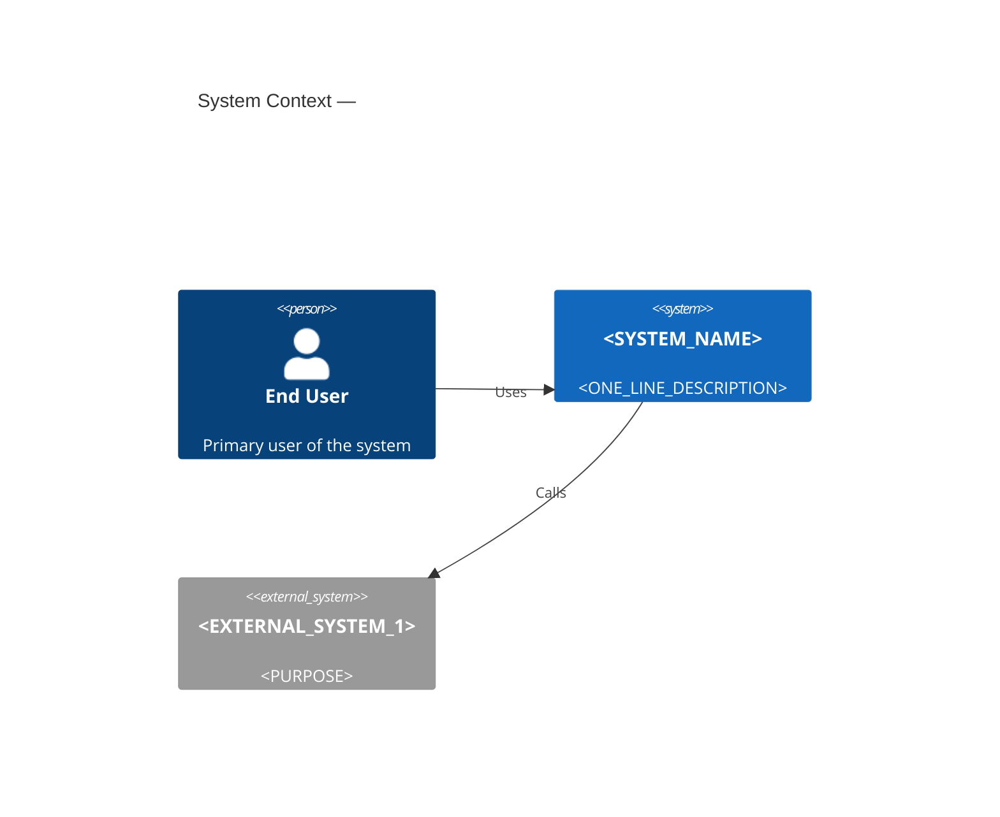
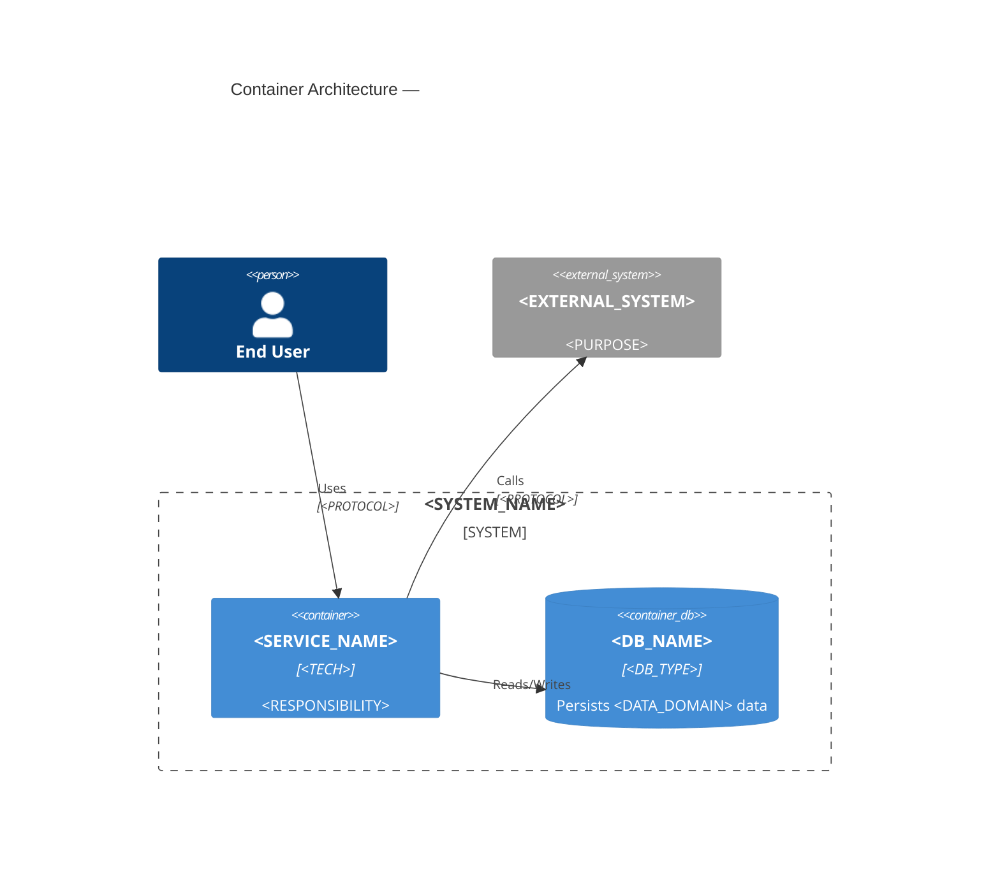
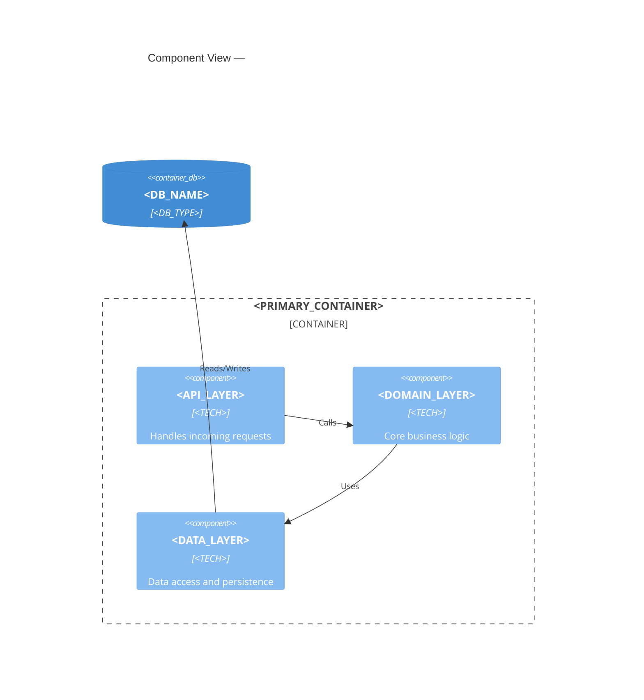
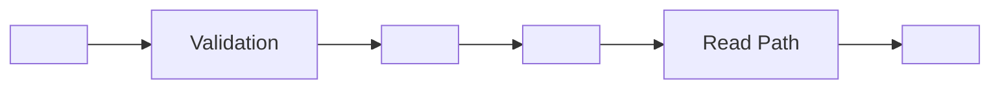
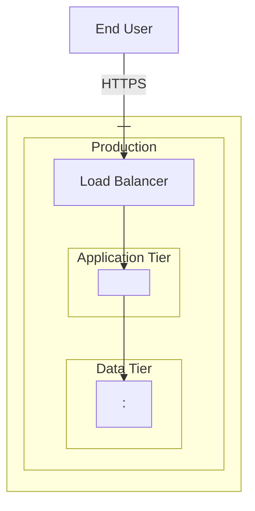

## Core Philosophy

Architecture documentation captures the **why**, not just the what. Every section must answer a specific question for a specific stakeholder audience. Stable architectural facts only — never volatile implementation details. Documentation lives close to the code, in version control, updated as part of the development workflow.

---

## Step 1 — Detect Project State and Architecture Style

### Phase A — Existing docs inventory

Search for: `docs/architecture/`, `docs/arch/`, `docs/design/`, `architecture/`, `ARCHITECTURE.md`

Existing docs found?
  └─ YES → Classify each canonical file against the 10-section output structure:
           - `[present + complete]` = substantive content, > 200 words (excluding code/Mermaid blocks), < 2 TODOs/PLACEHOLDERs
           - `[present + stub]`    = exists but < 200 words, only headings, or > 2 `<PLACEHOLDER>`/`TODO`/`TBD` occurrences
           - `[missing]`           = not present at all
           Set `MODE = "gap-fill"`. Produce gap report (see Step 3a) before writing anything.
  └─ NO  → Set `MODE = "greenfield"`. Generate all files from scratch.

Search for existing ADRs: `doc/adr/`, `docs/adr/`, `docs/decisions/`, any `*adr*` directory.
  └─ Found → Set `ADR_OFFSET = (highest existing number + 1)`
  └─ Not found → Set `ADR_OFFSET = 1`

### Phase B — Architecture style detection

```
docker-compose.yml / docker-compose.yaml exists?
  └─ YES → Count services defined
           ≥ 3 services → candidate: Microservices
           < 3 services → candidate: Monolith with containers

Service mesh config? (istio.yaml, linkerd.yaml, *service-mesh*, *mesh*)
  └─ YES → Confirm Microservices; note service mesh for 05-deployment.md

Kubernetes manifests? (k8s/, kubernetes/, manifests/, helm/)
  └─ YES → Deployment target = Kubernetes

Event bus signals? (kafka, rabbitmq, pubsub, sqs, eventbridge, nats, *queue*, *topic*, *broker*)
  └─ YES → Architecture has Event-Driven concerns; load event-driven reference alongside primary style

Serverless config? (serverless.yml, template.yaml + SAM pattern, cdk.ts, Pulumi.yaml,
                    vercel.json, netlify.toml, functions/ directory)
  └─ YES → Architecture style = Serverless

Single src/ or app/ dir, no docker-compose, no serverless?
  └─ YES → Architecture style = Monolith

Multiple top-level service dirs with own package manifests (separate package.json, go.mod,
requirements.txt) or separate Dockerfiles?
  └─ YES → Architecture style = Microservices (Monorepo variant)

Genuinely ambiguous after all checks?
  └─ YES → See Ambiguity Handling below
```

**Ambiguity handling:**
Report what evidence was found for each candidate style. Ask ONE question:
> "I found signals for both [style A] and [style B]: [evidence list]. Which best describes this system?
> (a) Monolith — single deployable unit
> (b) Microservices — independently deployable services
> (c) Hybrid — modular monolith with some extracted services"

While waiting for the answer, pre-generate architecture-style-agnostic sections: README.md, 08-technology-stack.md, 10-glossary.md, and `adr/` files.

### Phase C — Technology stack detection

Scan manifest files and infer:

```
package.json present?
  └─ YES → Runtime: Node.js
           Check "dependencies":
             express / fastify / hapi   → REST API framework (Node)
             nestjs                     → REST API framework (Node, opinionated)
             next / nuxt / remix        → Full-stack SSR
             react / vue / angular      → Frontend SPA
             Note framework in stack

requirements.txt / pyproject.toml / setup.py present?
  └─ YES → Runtime: Python
           django / flask / fastapi     → REST API framework (Python)

go.mod present?
  └─ YES → Runtime: Go
           gin / chi / echo / fiber     → REST API framework (Go)
           google.golang.org/grpc       → gRPC service

pom.xml / build.gradle present?
  └─ YES → Runtime: Java or Kotlin

Cargo.toml present?       → Runtime: Rust
Gemfile present?          → Runtime: Ruby
*.csproj present?         → Runtime: .NET / C#

Dockerfile present?       → Containerised deployment
*.tf / *.tfvars present?
  └─ YES → Scan provider block:
             aws      → Cloud: AWS
             google   → Cloud: GCP
             azurerm  → Cloud: Azure
cdk.ts present?           → IaC: AWS CDK; Cloud: AWS
Pulumi.yaml present?      → IaC: Pulumi
.github/workflows/ present? → CI/CD: GitHub Actions
.gitlab-ci.yml present?     → CI/CD: GitLab CI
```

### Phase D — Code communication pattern analysis

Scan source files for inter-service communication signals. Results label the arrows in the container diagram.

```
fetch / axios / requests / http.Get + URL patterns → REST
*.proto files / grpc import                         → gRPC
kafka / rabbitmq / pubsub / sqs client calls        → Event/queue messaging
*.graphql files / graphql / apollo imports          → GraphQL
celery / bull / sidekiq                             → Background job queues
```

### Phase E — Cross-cutting concerns scan

Scan for the following patterns. Results populate `06-cross-cutting-concerns.md`.

```
Authentication / Authorization:
  jwt / jsonwebtoken / PyJWT / golang-jwt  → JWT-based auth
  passport / authlib / spring-security     → Auth framework
  middleware named auth* / guard* / require_auth → Custom auth middleware
  oauth / oidc                             → OAuth / OIDC

Logging:
  winston / pino / morgan     → Node.js logging
  structlog / loguru          → Python logging
  zerolog / slog / zap        → Go logging
  log4j / slf4j               → Java logging

Observability:
  opentelemetry / otel   → OpenTelemetry (distributed tracing)
  datadog / dd-trace     → Datadog APM
  prometheus             → Prometheus metrics
  grafana                → Grafana dashboards
  jaeger / zipkin        → Distributed tracing

Caching:
  redis / ioredis / redis-py / go-redis → Redis
  memcached                              → Memcached

Error handling:
  centralised error handler middleware   → Centralised error handling
  @ControllerAdvice / error boundary     → Framework-level error handling
```

### Phase F — Data store scan

Scan for data store signals. Results populate `04-data-architecture.md`.

```
postgres / postgresql / pg / asyncpg   → Relational: PostgreSQL
mysql / mariadb / pymysql              → Relational: MySQL / MariaDB
sqlite / better-sqlite3                → Relational: SQLite
mongodb / mongoose / motor             → Document: MongoDB
dynamodb / @aws-sdk/client-dynamodb    → Document: DynamoDB
firestore / @google-cloud/firestore    → Document: Firestore
redis (non-cache usage)                → Key-value: Redis
elasticsearch / opensearch             → Search: Elasticsearch
s3 / @aws-sdk/client-s3 / google-cloud/storage → Object storage
neo4j                                  → Graph: Neo4j
```

**Hard rules — NEVER (Step 1):**
- Never infer Microservices solely from multiple directories. Require explicit service isolation evidence: separate package manifests, separate Dockerfiles, or ≥ 3 docker-compose services.
- Never skip Phase A. Always check for existing docs before generating anything.
- Never ask the user for information that can be determined from the filesystem.
- Never overwrite a `[present + complete]` file without explicit user confirmation.

---

## Step 2 — Load References

```
Always load:
  references/universal.md
  references/frameworks/c4-model.md
  references/frameworks/adrs.md

Architecture style:
  Monolith              → references/project-types/monolith.md
  Microservices         → references/project-types/microservices.md
  Serverless            → references/project-types/serverless.md
  Event-Driven signals  → references/project-types/event-driven.md (alongside primary style)
  Ambiguous / Hybrid    → references/project-types/monolith.md
                          AND references/project-types/microservices.md
```

---

## Step 3 — Analyse and Plan Generation

### 3a. Gap report (gap-fill mode only)

Before writing any file, output:

```
Found N existing files in docs/architecture/.

  Complete (will skip):   [list of files]
  Stub (will enrich):     [list of files]
  Missing (will generate):[list of files]
```

Do not ask permission to proceed unless a `[present + complete]` file would be overwritten.

### 3b. ADR pre-fill scan

Identify up to 5 architecturally significant decisions from the codebase. Priority order:

1. Primary language / runtime (always infer)
2. Primary web framework (if detected)
3. Database choice (if detected)
4. Containerisation approach (if Dockerfile or docker-compose detected)
5. Async messaging approach OR monorepo tooling — whichever is detected first

Each inferred ADR:
- Status: `Proposed` (never `Accepted`)
- Includes a banner: `> ⚠️ INFERRED: This ADR was inferred from the codebase. Verify Context and Consequences before changing status to Accepted.`
- Context: pre-filled with what was detected
- Decision: pre-filled with the observed choice
- Rationale: `<TODO: document why this was chosen over alternatives>`
- Consequences: starter list drawn from the relevant project-type reference file

### 3c. Enrichment rules (stub files in gap-fill mode)

```
Read existing file
  → Identify headings with substantive content (> 50 words below heading)
  → Preserve all existing content exactly
  → Generate new content only under empty or stub headings
  → Append "<!-- enriched by architecture-docs skill, YYYY-MM-DD -->" at bottom
```

---

## Step 4 — Generate All Documentation Files

Always generate the full suite. In gap-fill mode, skip `[present + complete]` files and enrich `[present + stub]` files.

**Output structure:**

```
docs/architecture/
  README.md                               navigation index + section summary table
  01-system-context.md                    C4Context diagram + business scope + stakeholders
  02-container-architecture.md            C4Container diagram + service interactions
  03-component-view.md                    C4Component diagram + key internal structures
  04-data-architecture.md                 data models, storage strategy, data flow
  05-deployment.md                        infra diagram, environments, scaling, CI/CD
  06-cross-cutting-concerns.md            auth, logging, observability, caching, error handling
  07-quality-and-nfrs.md                  performance targets, SLAs, security baseline
  08-technology-stack.md                  stack table populated from manifest scan
  09-risks-and-debt.md                    risk table + tech debt prompts
  10-glossary.md                          domain terms skeleton
  adr/
    0001-record-architecture-decisions.md meta-ADR (status: Accepted)
    template.md                           blank ADR template
    000N-<inferred-decision>.md           up to 5 inferred stubs (status: Proposed)
  .checklist.md                           working doc — all remaining TODOs/PLACEHOLDERs
```

**Tense by mode:**
- `greenfield`: future tense — "This system will..."
- `gap-fill`: declarative present tense — "This system..."

**Required content per section:**

`README.md`
- Navigation table with link, one-line description, and primary audience for each section
- System name and one-paragraph overview
- How to keep docs current (triggers for updates)

`01-system-context.md`
- Audience: business stakeholders and architects
- C4Context diagram (see Step 5)
- External actors table: Name | Type (Person/System) | Interaction
- System purpose statement (2–3 sentences)
- Business context paragraph (why this system exists)

`02-container-architecture.md`
- Audience: architects and engineers
- C4Container diagram (see Step 5)
- Service responsibility table: Service | Technology | Responsibility | Entry Point
- Communication pattern summary (protocols used, sync vs. async)

`03-component-view.md`
- Audience: engineers
- C4Component diagram for the primary container (see Step 5)
- Internal dependency direction rules (e.g., "domain layer must not import infrastructure layer")
- Note: if architecture is Microservices with many small services, show components within the most complex service

`04-data-architecture.md`
- Data store inventory table: Store | Type | Technology | Data Owned | Shared? (flag as risk if YES)
- Data flow diagram (Mermaid flowchart, left-to-right)
- Data ownership notes (for Microservices: each service owns its store — flag shared DBs as risk)
- Schema/migration management note (ORM or migration tool detected)

`05-deployment.md`
- Deployment architecture diagram (Mermaid graph, top-down)
- Environments table: Environment | Purpose | URL/Endpoint | Deployment Trigger
- Scaling strategy (horizontal / vertical / auto-scaling if infra signals detected)
- CI/CD pipeline summary (from detected CI tool)

`06-cross-cutting-concerns.md`
- One sub-section per detected concern: Authentication, Logging, Observability, Caching, Error Handling
- Each sub-section: pattern used | implementation reference (file path or library) | gaps/TODOs
- If a concern is not detected: include the heading with "Not yet implemented — see 09-risks-and-debt.md"

`07-quality-and-nfrs.md`
- Quality goals table: Goal | Measurable Target | Priority (High/Med/Low)
  Pre-populate targets with TBD and add: `<!-- Replace TBD with real measurements — "high performance" is not a target -->`
- Constraints list: technical, organisational, legal
- Common NFR categories to address: Performance, Scalability, Availability, Security, Maintainability, Observability

`08-technology-stack.md`
- Stack table: Layer | Technology | Version (from manifest) | Rationale
  Populate Layer, Technology, and Version from manifest scan
  Rationale column: `<TODO: document why this was chosen>` per row
- Layers: Runtime, Web Framework, Data Layer, Infrastructure/IaC, CI/CD, Observability, Auth

`09-risks-and-debt.md`
- Risk table: Risk | Likelihood (H/M/L) | Impact (H/M/L) | Mitigation Strategy
  Pre-populate with inferred risks from project-type reference file
- Technical debt prompts: "Known shortcuts taken:", "Tests missing for:", "Performance not yet addressed:"

`10-glossary.md`
- Alphabetical table: Term | Definition
  Infer domain terms from source identifiers (class names, module names, route names)
  Pre-populate with project-specific terms found; mark unknown definitions as `<TODO>`

---

## Step 5 — Generate Mermaid Diagrams (Native C4 Syntax)

Use Mermaid's native C4 diagram types. Every stub must be valid, parseable Mermaid — placeholders are `<UPPERCASE_SNAKE_CASE>`. Every stub has a `<!-- TODO: replace placeholders with actual names -->` comment above it.

### Context diagram — 01-system-context.md

Populate `<SYSTEM_NAME>` from `package.json.name`, `go.mod` module name, or repository directory name.
Detect external systems from known third-party SDK names in manifests (stripe, sendgrid, twilio, auth0, etc.).

```
<!-- TODO: replace placeholders with actual names -->


### Container diagram — 02-container-architecture.md

One `Container` node per docker-compose service or detected deployable unit.
One `ContainerDb` per detected data store.
Communication arrows labeled with detected protocol (REST / gRPC / events / GraphQL).

```
<!-- TODO: replace placeholders with actual names -->


### Component diagram — 03-component-view.md

Infer components from top-level source directories or module groupings within the primary container.

```
<!-- TODO: replace placeholders with actual names -->


### Data flow diagram — 04-data-architecture.md

```
<!-- TODO: replace placeholders with actual data sources and sinks -->


### Deployment diagram — 05-deployment.md

Populate cloud provider from Terraform provider block, region from resource names where detectable.

```
<!-- TODO: replace placeholders with actual infrastructure details -->


**Diagram hard rules — NEVER:**
- Generate PlantUML — Mermaid only (renders natively on GitHub)
- Write an unclosed Mermaid fence block — broken diagrams are worse than none
- Include library versions, env variable names, or internal URL paths in diagrams
- Show technology detail at Context level (C4Context shows people and systems only)

---

## Step 6 — Generate ADR Files

### `adr/template.md`

```markdown
# ADR <NUMBER>: <TITLE>

**Date:** <YYYY-MM-DD>
**Status:** Proposed | Accepted | Deprecated | Superseded by [ADR-XXXX](XXXX-title.md)
**Deciders:** <names or roles>

## Context

<What situation or problem forces this decision? Include constraints: technical,
organisational, regulatory. Describe the forces at play. Focus on stable context
— exclude transient details that will become irrelevant.>

## Decision

<State the decision in one or two sentences. Begin: "We decided to..." or "We will use...">

## Rationale

<Why was this chosen over the alternatives? Name the alternatives considered and why each
was rejected. Be specific about trade-offs.>

## Consequences

### Positive
- <What becomes easier or better?>

### Negative
- <What becomes harder, slower, or more expensive?>
- <What new obligations does this create?>

### Neutral / Risks
- <What is uncertain? What risks does this introduce?>

## Related Decisions
- Supersedes: (none)
- Superseded by: (none)
- Related: (none)
```

### `adr/0001-record-architecture-decisions.md`

Pre-filled meta-ADR. Content:

```markdown
# ADR 0001: Record Architecture Decisions

**Date:** <generation date>
**Status:** Accepted
**Deciders:** Engineering team

## Context

When making significant architectural decisions, we need a way to document what was decided,
why, and what the trade-offs are. Without this, future maintainers must reverse-engineer intent
from code, repeat discussions that have already been resolved, and cannot understand the
constraints that shaped the current design.

## Decision

We will use Architecture Decision Records (ADRs), as described by Michael Nygard, to document
all significant architectural decisions. ADRs are stored in `docs/architecture/adr/`, numbered
sequentially, and kept in the repository alongside the code they describe.

## Rationale

ADRs are lightweight (one Markdown file per decision), version-controlled, discoverable by
engineers (same repo as the code), and create an immutable historical record. Alternatives
considered: wiki pages (not version-controlled with code), comments in code (not structured,
hard to discover), verbal agreement (lost when team members leave).

## Consequences

### Positive
- Architectural decisions are discoverable without asking senior team members
- New engineers can understand why the system is built the way it is
- Decisions are immutable — accepted ADRs are superseded, not edited

### Negative
- Requires discipline to write an ADR for every significant decision
- Team must agree on what counts as "significant"

### Neutral / Risks
- ADRs describe intent at the time of decision — reality may diverge; validate ADRs during
  architectural reviews

## Related Decisions
- Supersedes: (none)
- Superseded by: (none)
```

### Inferred ADR stubs (up to 5)

Generated for each inferred decision in priority order. Each has:
- Status: `Proposed`
- Banner at top: `> ⚠️ INFERRED: This ADR was inferred from the codebase. Verify Context and Consequences before changing status to Accepted.`
- Context: what was detected (e.g., "PostgreSQL dependency found in package.json")
- Decision: the observed choice (e.g., "We use PostgreSQL as the primary relational database")
- Rationale: `<TODO: document why this was chosen over alternatives such as MySQL, SQLite, or a NoSQL store>`
- Consequences: starter list from the project-type reference

**Hard rules — NEVER (ADRs):**
- Set an inferred ADR status to `Accepted` — always `Proposed`
- Generate more than 5 inferred stubs — more unreviewed stubs create noise, not clarity
- Edit an existing accepted ADR — create a new ADR that supersedes it

---

## Step 7 — Write Files and Report

Write all files to `docs/architecture/` from the project root.

After writing, generate `.checklist.md` with:
- Every remaining `<PLACEHOLDER>` across all files (file name + approximate section)
- Every `TODO` in ADR files (file name + field)
- Every `INFERRED` ADR (file name + current status)
- Every section with "requires team input" content (07-quality-and-nfrs.md, 09-risks-and-debt.md)

**Post-write summary to output:**

```
Architecture documentation generated at docs/architecture/

Files written:
  ✓ README.md
  ✓ 01-system-context.md          — C4Context diagram (<N> external actors detected)
  ✓ 02-container-architecture.md  — C4Container diagram (<N> services/stores detected)
  ✓ 03-component-view.md          — C4Component diagram (<N> components inferred)
  ✓ 04-data-architecture.md       — <N> data stores documented
  ✓ 05-deployment.md              — Deployment target: <DETECTED_TARGET>
  ✓ 06-cross-cutting-concerns.md  — <N> concerns documented
  ✓ 07-quality-and-nfrs.md        — Requires team input for measurable targets
  ✓ 08-technology-stack.md        — <N> stack layers populated
  ✓ 09-risks-and-debt.md          — <N> risks inferred from architecture style
  ✓ 10-glossary.md                — <N> domain terms inferred
  ✓ adr/0001-record-architecture-decisions.md
  ✓ adr/template.md
  ✓ adr/000N-<title>.md           — INFERRED, requires review (×<N>)
  ✓ .checklist.md                 — <N> items require human input

Priority next steps:
  1. Review INFERRED ADRs in docs/architecture/adr/ — set status to Accepted or Rejected
  2. Replace <PLACEHOLDER> values in all diagram stubs
  3. Fill in 07-quality-and-nfrs.md with real, measurable targets
  4. Review .checklist.md for remaining gaps

Validate diagrams locally:
  npx @mermaid-js/mermaid-cli -i docs/architecture/02-container-architecture.md -o /tmp/diagram.png
```

---

## Hard Rules — Global

- Never put code-level detail in architecture docs: no function signatures, field types, variable names, or internal URL paths
- Never document volatile implementation details — document stable architectural facts
- Never generate all-or-nothing docs if gap-fill mode is detected — always honour existing complete files
- Never use future tense ("will be") for architecture that is already built — verify MODE first
- Diagrams describe architecture, not implementation — a class diagram is not a C4 diagram
