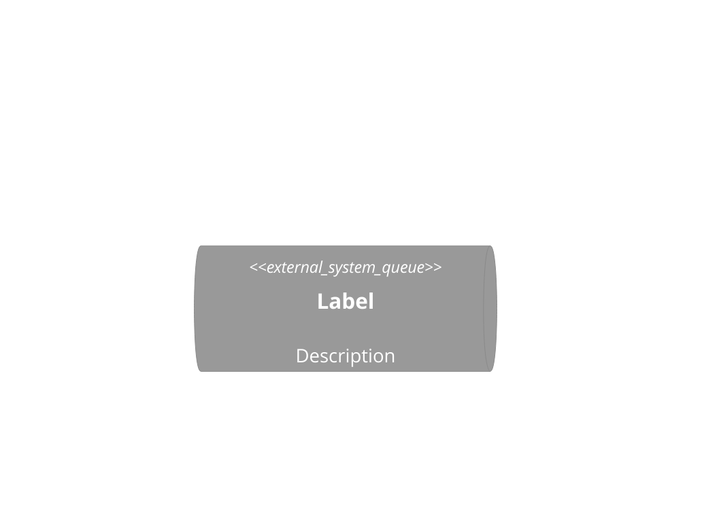
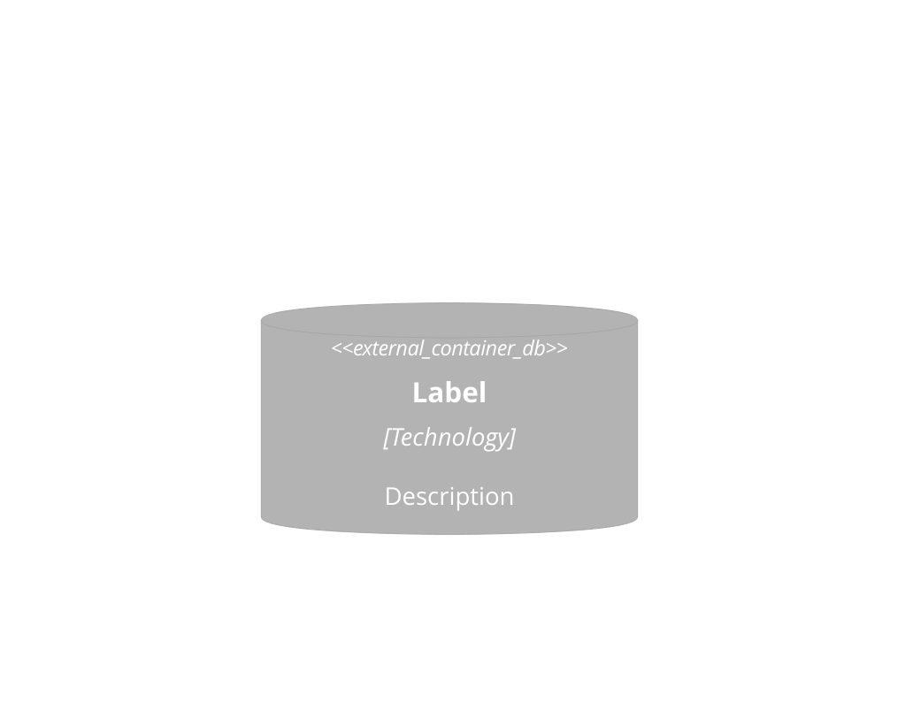
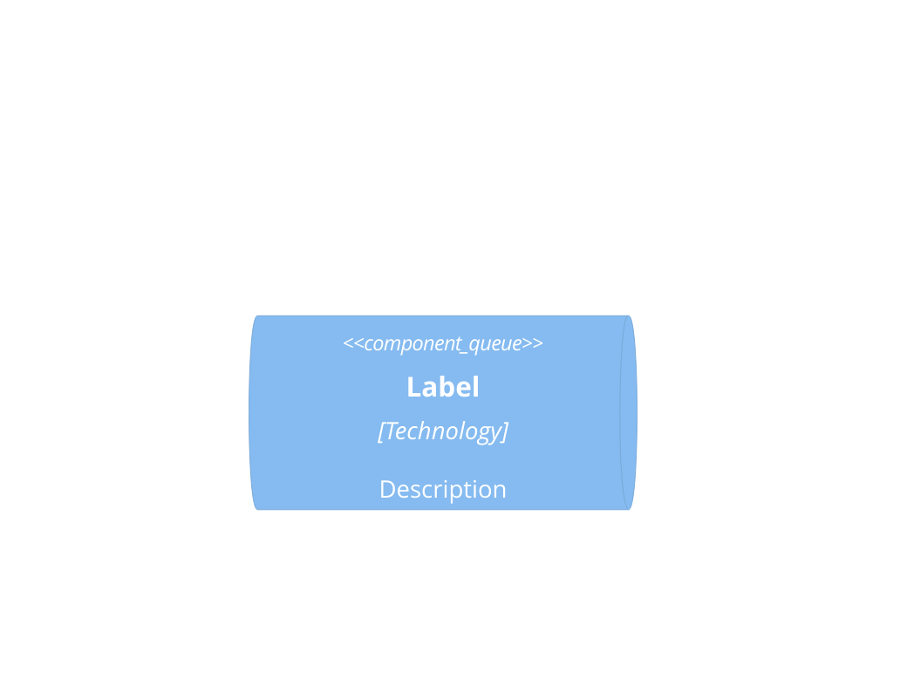
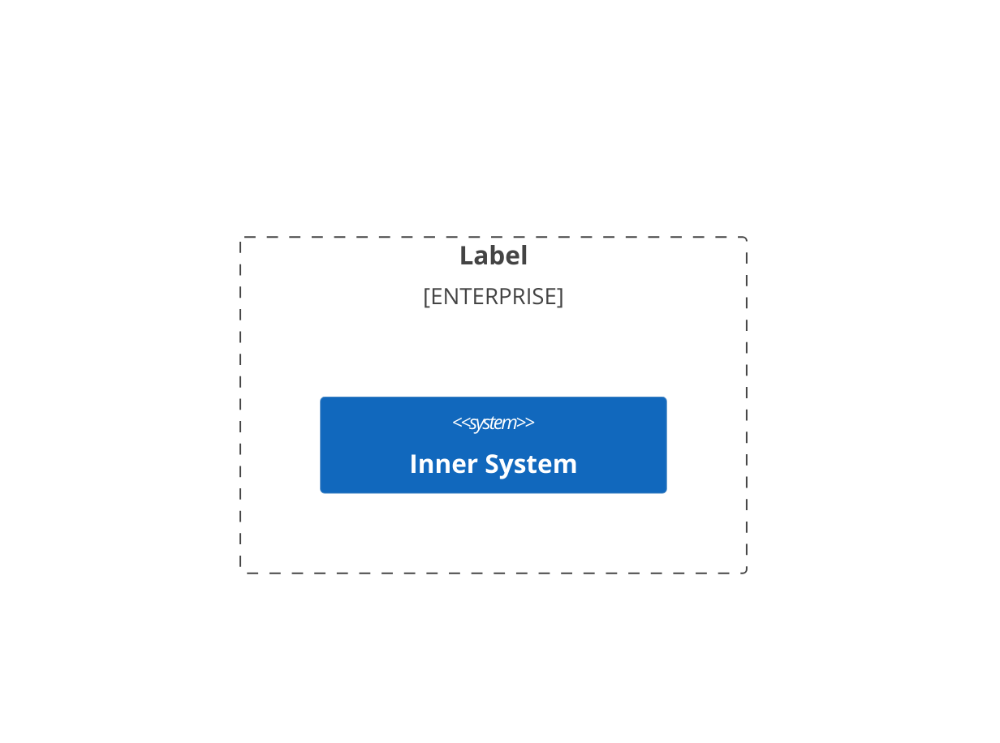
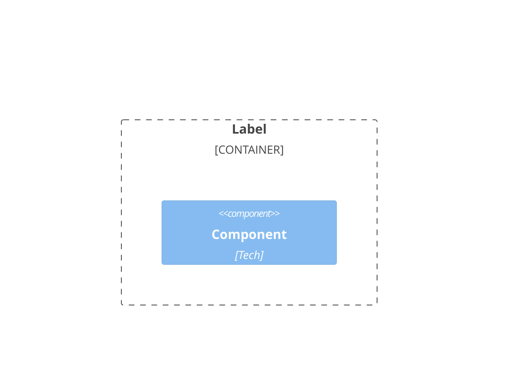
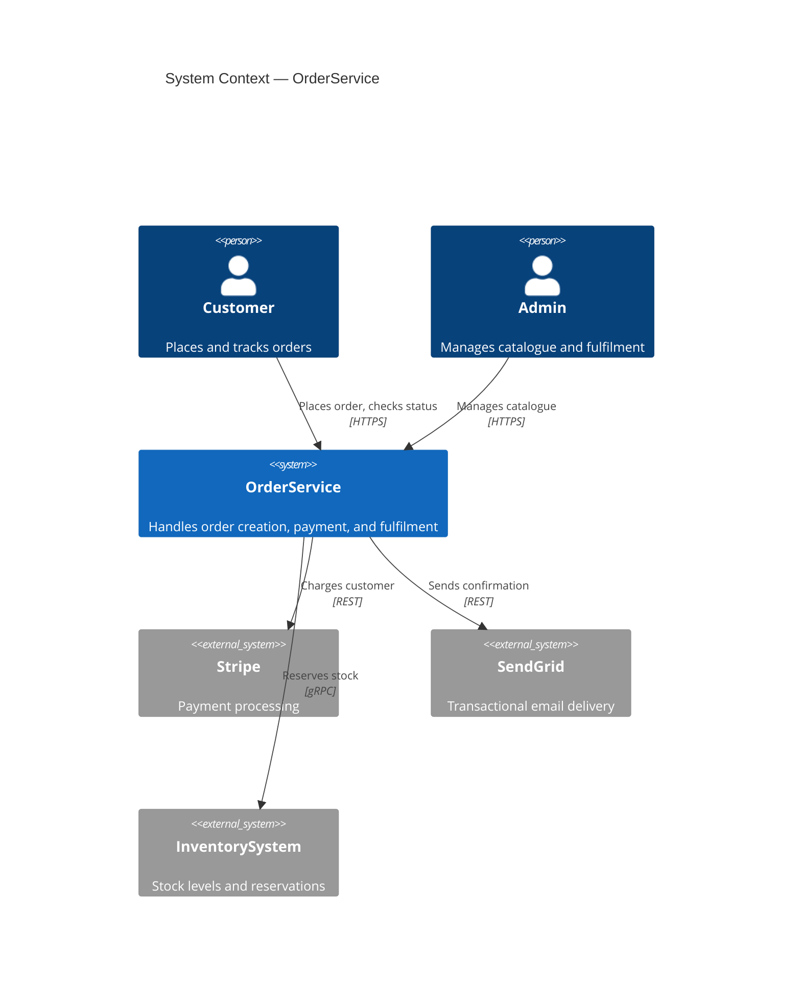
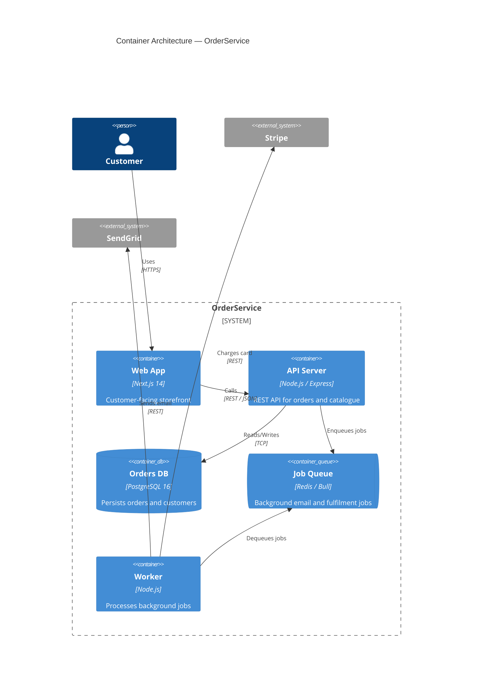

# C4 Model Reference

Authority: C4 Model by Simon Brown — https://c4model.com
Mermaid C4 syntax: https://mermaid.js.org/syntax/c4.html

---

## 1. Four Level Definitions

The C4 Model describes software architecture using four hierarchical levels of abstraction, each answering a different question for a different audience.

### Level 1 — System Context

**Question answered:** What does this system do and how does it fit in the world?
**Audience:** Business stakeholders, product managers, non-technical readers

The Context diagram shows the software system in scope (one box) and its relationships with users and other software systems around it. Everything outside the central box is outside your system boundary.

**What belongs here:**
- People (human users, roles)
- External software systems that your system interacts with
- The primary system itself as a single box

**What never belongs here:**
- Internal structure (containers, components, modules)
- Technology choices or framework names
- Database names or specific implementation decisions
- Internal communication patterns

### Level 2 — Container Architecture

**Question answered:** What are the major deployable units and how do they communicate?
**Audience:** Architects, senior engineers

A "container" in C4 is anything that runs or stores something: a server-side application, a single-page app, a mobile app, a desktop app, a database, a file system, a shell script. Not Docker containers specifically — the term predates Docker.

**What belongs here:**
- Every independently deployable unit (web server, API server, mobile app, SPA)
- Every data store (relational DB, document DB, cache, message queue, object storage)
- Communication protocols between containers (REST, gRPC, events, GraphQL)
- Technology labels on each container (Node.js, PostgreSQL, Redis)

**What never belongs here:**
- Internal module or class structure
- Library-level choices within a container
- Code-level implementation detail

### Level 3 — Component View

**Question answered:** What are the major structural units inside a specific container?
**Audience:** Engineers working on that container

A "component" is a grouping of related functionality behind a well-defined interface — typically a module, package, layer, or bounded context. One Component diagram per container (focus on the most architecturally significant).

**What belongs here:**
- Major module/package groupings (e.g., API layer, domain layer, data layer)
- Key interfaces and abstractions
- Data access components
- Background job or worker components

**What never belongs here:**
- All classes (a C3 diagram with 50 nodes is useless)
- Helper and utility classes
- Test components
- Truly internal private implementation

### Level 4 — Code (rarely needed)

**Question answered:** How is a specific component implemented?
**Audience:** Engineers who need the deepest level of understanding

Level 4 is almost never needed in architecture documentation — the code is the documentation at this level. Only generate a Level 4 diagram for genuinely complex algorithmic or structural decisions that cannot be understood from reading the code alone.

---

## 2. Native Mermaid C4 Syntax Reference

Mermaid supports C4 diagram types natively. Use these, not `graph TB` with manually formatted labels.

### Element types







### Boundaries






### Relationships

```mermaid
  Rel(from, to, "Label")
  Rel(from, to, "Label", "Technology")
  BiRel(from, to, "Label")
  Rel_Back(from, to, "Label")
  Rel_Neighbor(from, to, "Label")
  Rel_Up(from, to, "Label")
  Rel_Down(from, to, "Label")
  Rel_Left(from, to, "Label")
  Rel_Right(from, to, "Label")
```

### Layout control

```mermaid
  UpdateLayoutConfig($c4ShapeInRow, "3", $c4BoundaryInRow, "1")
```

Use `UpdateLayoutConfig` when a diagram has many elements and the default layout produces overlapping arrows.

### Titles and notes

```mermaid
C4Context
  title System Context — <SYSTEM_NAME>
  UpdateElementStyle(alias, $fontColor="red", $bgColor="grey")
  UpdateRelStyle(from, to, $textColor="blue", $lineColor="blue")
```

---

## 3. Complete Examples (valid, parseable)

### Context diagram example



### Container diagram example



---

## 4. Diagram Anti-Patterns

**Too many nodes at the wrong level.**
A Context diagram with 15 boxes, or a Component diagram with 40 components, communicates nothing. Ruthlessly simplify. If a level-2 diagram has more than 15 containers, group by capability domain and show detail in separate level-3 diagrams.

**Unlabelled relationship arrows.**
`A --> B` with no label tells the reader nothing about what flows between them or why. Every `Rel()` must have a label. Every label should complete the sentence: "A [label] B."

**Technology soup at Level 1.**
Showing Kubernetes, PostgreSQL, and React at the Context level does not help a business stakeholder understand the system. Technology belongs at Level 2 and below.

**Missing system boundary.**
Without a `System_Boundary`, it is unclear what is inside your system vs. outside. Always wrap your containers inside a `System_Boundary`.

**Describing code structure as architecture.**
"The `UserService` class calls the `AuthMiddleware`" is not an architectural concern. Architecture describes deployable units and their boundaries, not internal class interactions.

**Diagram-as-code drift.**
A diagram that reflects what the system *was* three months ago is misleading. Architecture diagrams must be reviewed as part of any structural change.
