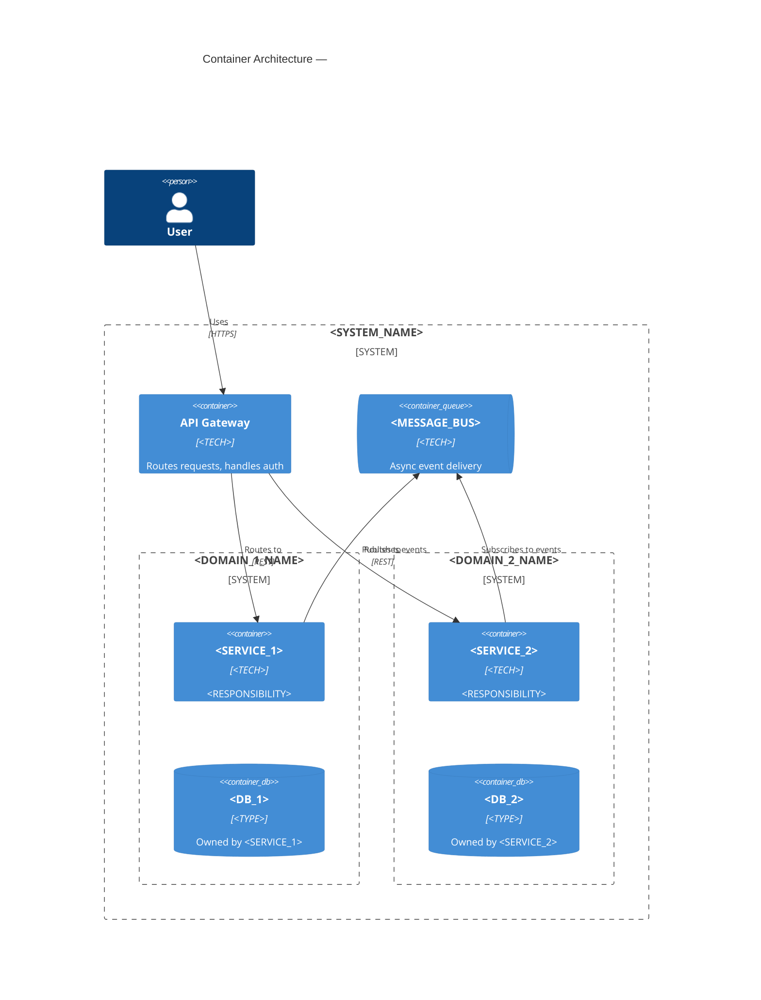

# Microservices Architecture Documentation Reference

---

## 1. Microservices-Specific Documentation Concerns

A microservices architecture consists of multiple independently deployable services, each responsible for a bounded domain. The documentation challenge is the opposite of a monolith: the boundary between services is the most important thing to document, not the internal structure.

**Core questions your documentation must answer:**

- What services exist, what does each one own, and who is responsible for it?
- How do services communicate (sync vs. async, protocols, API contracts)?
- Who owns which data? Are there shared databases? (flag as risk)
- How does the system behave when a service is unavailable?
- How are distributed transactions handled?
- How is the system observed in production?

---

## 2. Service Inventory

Every service must be documented in `02-container-architecture.md` with a service responsibility table:

| Service | Technology | Responsibility | Entry Points | Data Owned | Owner Team |
|---|---|---|---|---|---|
| `<service-name>` | `<runtime>` | One sentence | REST/gRPC/events | `<DB or table scope>` | `<team or TBD>` |

**Rules:**
- Responsibility must be one sentence. If it takes two sentences, the service may have too many concerns.
- Every service must have a named data owner — if a service shares a database with another, flag it.
- Entry points: note the protocol (REST, gRPC, events) and the host/base path if known.

**For large architectures (> 10 services):** Group services into capability domains in the Level 2 container diagram. Each domain gets a `System_Boundary`. Show individual services in Level 3 diagrams, one per domain.

---

## 3. Container Diagram Guidance for Microservices



---

## 4. API Contract Documentation

**Synchronous contracts:**
- REST: Reference the OpenAPI specification file. Do not duplicate endpoint signatures in architecture docs.
  Example: "API contract defined in `services/<service>/openapi.yaml`"
- gRPC: Reference the proto file.
  Example: "Service contract defined in `proto/<service>.proto`"

**Asynchronous contracts (events/messages):**
- Document the event schema or reference a schema registry
- Include in `04-data-architecture.md` as an event catalog sub-section

**Cross-service contract rules to document:**
- Who is the owner of a shared schema? (producer owns it, consumers adapt)
- What is the versioning strategy? (additive-only changes, semantic versioning)
- Is there a schema registry? (Confluent Schema Registry, AWS Glue, etc.)
- What is the backward-compatibility policy?

---

## 5. Distributed Data Architecture

Include in `04-data-architecture.md`:

**Data ownership table:**

| Data Domain | Owning Service | Store Type | Shared With Others? |
|---|---|---|---|
| `<domain>` | `<service>` | `<type>` | No (correct) / Yes — `<service-list>` (risk) |

**Shared database risk:** If any service shares a database with another:
> ⚠️ **Risk: Shared database.** `<service-A>` and `<service-B>` share `<db-name>`. This creates deployment coupling (schema changes require coordinated releases) and ownership ambiguity. Recommended: extract shared data into a dedicated service or define a clear read/write ownership boundary.

**Distributed transaction strategy:**
Document which pattern is used (or note if it is not yet addressed):
- **Saga pattern** (choreography or orchestration) — preferred for microservices
- **Two-phase commit (2PC)** — anti-pattern in microservices, document if present with risk note
- **Eventual consistency accepted** — document the consistency guarantees (and their limits) per domain

---

## 6. Service Mesh and Observability

If a service mesh is detected (Istio, Linkerd, Envoy):

Include in `05-deployment.md`:

```
Service mesh: <MESH_NAME>
  Traffic management:
    - Retries: <policy>
    - Timeouts: <policy>
    - Circuit breaker: <policy>
  mTLS: enabled / disabled
  Traffic routing: <canary / blue-green / none>
```

**Distributed tracing is mandatory documentation for microservices.** Without it, debugging production issues is essentially impossible.

Include in `06-cross-cutting-concerns.md`:

```
Observability strategy:
  Traces: <tracing-tool> — trace IDs propagated via <header-name>
  Metrics: <metrics-tool> — per-service RED metrics (Rate, Errors, Duration)
  Logs: <logging-tool> — structured logs with trace ID correlation
  Alerts: <alerting-tool> — alerts defined in <location>

Correlation ID strategy:
  All requests carry a correlation ID in header <header-name>.
  All log lines include the correlation ID.
  All spans include the correlation ID.
```

---

## 7. Failure Mode Catalog

Include a sub-section in `09-risks-and-debt.md`:

| Failing Component | Impact | Mitigation in Place |
|---|---|---|
| `<service>` unavailable | `<downstream impact>` | Circuit breaker / timeout / fallback / retry |
| `<message-bus>` unavailable | `<downstream impact>` | Dead-letter queue / retry policy |
| `<database>` unavailable | `<downstream impact>` | Read replica / graceful degradation |

For each critical service, document: "If `<service>` is unavailable, `<what happens to dependent services and end users>`."

---

## 8. Common Microservices Risks to Pre-Populate in `09-risks-and-debt.md`

| Risk | Likelihood | Impact | Mitigation |
|---|---|---|---|
| Distributed system fallacies — assuming network is reliable, latency is zero, bandwidth is infinite | High | High | Implement timeouts, retries with exponential backoff, and circuit breakers |
| Shared database anti-pattern — multiple services write to the same schema | Medium | High | Establish clear data ownership; migrate to per-service data stores |
| No distributed tracing — impossible to debug cross-service request failures | Medium | High | Instrument with OpenTelemetry; propagate trace IDs |
| Cascading failures — one service failure brings down dependent services | Medium | High | Circuit breakers (Resilience4j, Polly, go-resiliency) |
| Schema evolution breaks consumers — producer changes event schema, consumers fail | Medium | High | Schema registry with backward-compatibility enforcement |
| Distributed transactions using 2PC | Low | High | Replace with Saga pattern; document consistency trade-offs |
| Service discovery configuration drift | Low | Medium | Use infrastructure-as-code for all service registrations |
