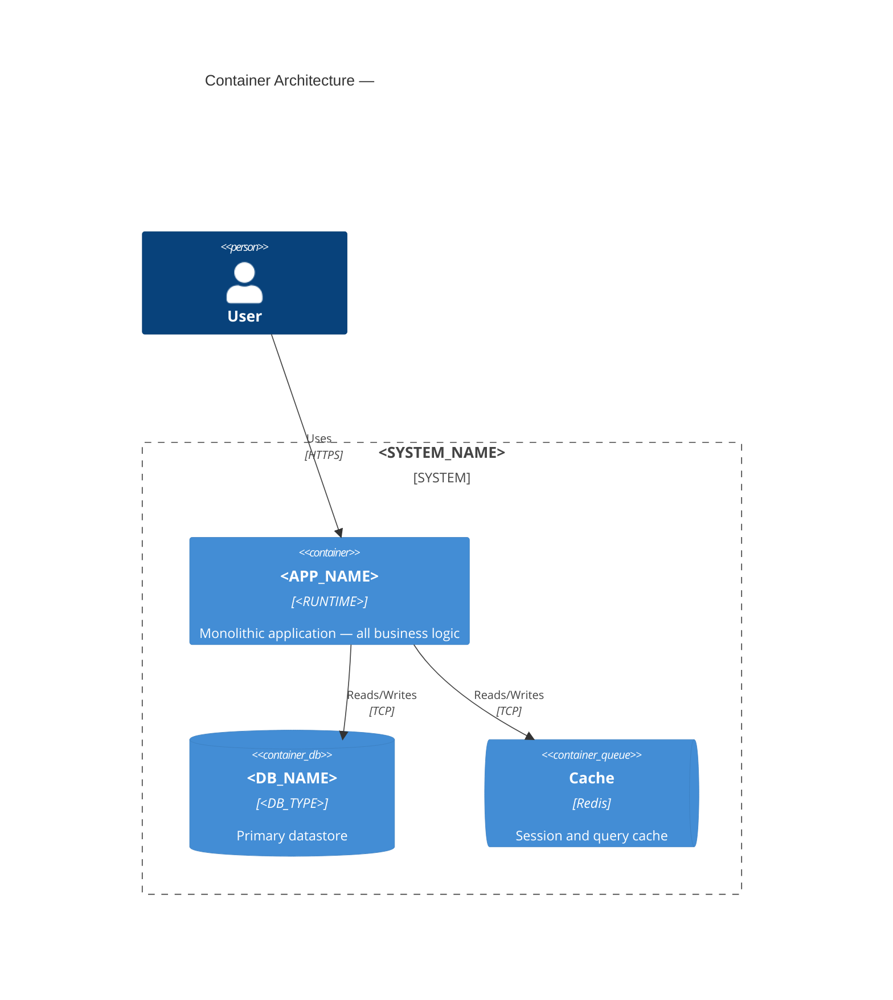
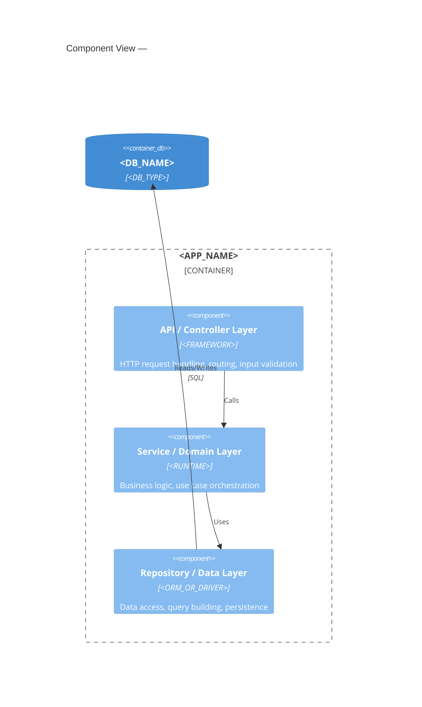

# Monolith Architecture Documentation Reference

---

## 1. Monolith-Specific Documentation Concerns

A monolith is a single deployable unit where all application functionality is built, tested, and deployed together. The key documentation concerns are different from microservices — the challenge is not *communication between services* but *internal coupling and modularity*.

**Core questions your documentation must answer:**

- What are the intended module/layer boundaries, and are they enforced?
- What is the direction of dependency between layers?
- Which modules are most tightly coupled, and is that a risk?
- How does the system scale — vertically, or horizontally with shared-nothing instances?
- What is the deployment unit — the entire application, or can modules be deployed independently in future?

---

## 2. Container Diagram Guidance for Monoliths

A monolith gets **one `Container` node** in the C4 Level 2 diagram. Do not decompose into modules at the container level — that is a Level 3 concern.

**Valid additional containers for a monolith:**
- Background worker process (if it runs as a separate OS process)
- Database migration runner (if run independently)
- Scheduled job runner (if run independently, e.g., cron)
- Admin interface (if deployed separately from the main app)

**Common mistake:** Drawing every logical module as a separate container. A module that runs in the same process and is deployed with the same artifact is not a container — it is a component.

**Example container diagram for a monolith:**



---

## 3. Component View for Monoliths

The Component diagram (Level 3) is where monolith internal structure becomes visible. This is the most important diagram for a monolith — it shows whether the system has meaningful internal organisation or is a ball of mud.

**Standard layers to document:**



**Document the dependency direction rule explicitly.** Example: "The domain layer must not import the infrastructure layer. The repository layer must not import the service layer. Violations of these rules are architectural risks."

---

## 4. Internal Coupling Documentation

Beyond the component diagram, document the actual vs. intended module boundaries.

**What to document:**

- **Intended boundaries** — even if not enforced by the language or framework, document what the intended isolation is. This is aspirational architecture and should be labelled as such.
- **Actual boundaries** — note where coupling violates the intended structure (flag as risk)
- **Circular dependencies** — note as a risk with priority for resolution
- **Shared mutable state** — global state, class-level singletons, or process-level caches shared across modules

**In `09-risks-and-debt.md`, include:**
- High-coupling module pairs (if detectable from imports)
- Circular dependency cycles
- Layers that are mixed (e.g., SQL queries in controllers)

---

## 5. Monolith Scaling Strategy

Include in `05-deployment.md`:

```
Scaling approach:
  Horizontal (multiple instances of the same monolith):
    - Requires stateless application design
    - Session must be externalised (Redis, DB-backed sessions, JWT)
    - File uploads must use shared storage (S3, NFS) not local filesystem
  
  Vertical (larger machine):
    - Simpler to operate
    - Has a ceiling — document the expected peak load

Deployment coupling:
  All modules deploy together — a bug in any module requires a full redeploy
  Consider: feature flags for high-risk changes, blue/green deployment to reduce downtime
```

---

## 6. Common Monolith Risks to Pre-Populate in `09-risks-and-debt.md`

| Risk | Likelihood | Impact | Mitigation |
|---|---|---|---|
| Big ball of mud — coupling increases over time as module boundaries erode | Medium | High | Enforce layer boundaries via linting or architecture tests |
| Database coupling — all modules share a single schema, making schema changes high-risk | Medium | High | Consider schema segregation per domain; avoid cross-domain JOINs |
| Deployment coupling — a bug in one module prevents all modules from deploying | Low | High | Feature flags, staging environment parity, automated rollback |
| Horizontal scaling blocked by local state (filesystem, in-memory cache, sessions) | Low | Medium | Audit for local state; externalise to shared backing service |
| Long build and test times as the codebase grows | Medium | Medium | Module-level test execution, build caching |

---

## 7. Modulith Documentation (Modular Monolith)

If the project shows signs of a modular monolith (intentional internal module boundaries with enforced isolation, possibly using explicit package visibility rules):

Document each module as if it were a service:
- Module name
- Bounded context / domain area
- Public API (exported functions, classes, events)
- Data ownership (which DB tables / collections)
- External dependencies (which other modules it imports)

Flag: "This is a modulith — modules have enforced boundaries and could be extracted into microservices. The container diagram currently shows one container; if extraction occurs, each module becomes a container."
