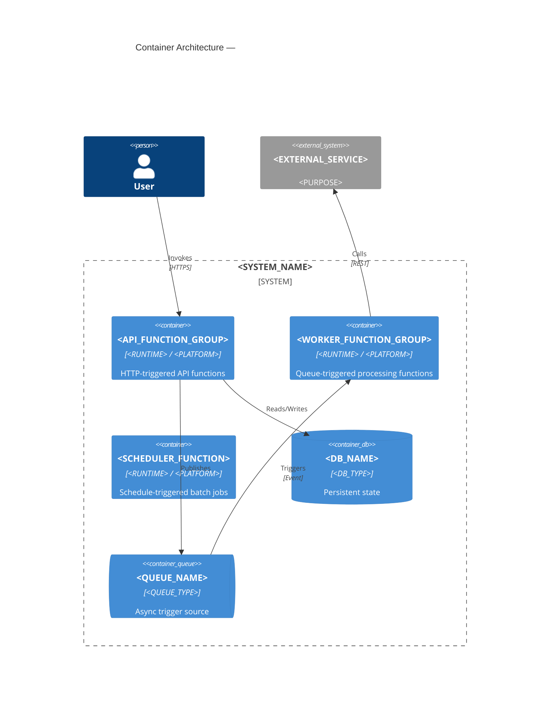

# Serverless Architecture Documentation Reference

---

## 1. Serverless-Specific Documentation Concerns

A serverless architecture consists of functions invoked on demand by triggers, with no persistent server process. The documentation challenge is that the deployment unit (a function) is much smaller than a microservice, and the trigger mechanism is itself an architectural artifact that must be documented.

**Core questions your documentation must answer:**

- What functions exist, what triggers invoke them, and what do they do?
- What is the state management strategy? (Serverless functions are stateless by design)
- What are the cold start characteristics and acceptable latency?
- How are functions composed into workflows?
- What is the cost model and are there high-frequency functions that should be reconsidered?
- How are failures handled — retry policies, dead-letter queues, error visibility?

---

## 2. Functions as Containers (C4 Level 2)

In the C4 model, serverless functions are containers — they are the deployable units. Each function (or logical group of closely related functions) gets a `Container` node.

**Grouping strategy:**
- Group functions by trigger type and domain: "Order Functions", "Notification Functions"
- If there are more than 8–10 function nodes, group into functional domains and show individual functions in a Level 3 diagram
- Triggers are shown as external systems or internal event buses, not as containers



---

## 3. Trigger Catalog

Include in `02-container-architecture.md` a trigger catalog table — every function trigger is an architectural artifact:

| Function | Trigger Type | Trigger Source | Schedule / Event | Timeout | Concurrency Limit |
|---|---|---|---|---|---|
| `<function-name>` | HTTP | API Gateway | Any request to `/path` | 30s | 1000 |
| `<function-name>` | Queue | SQS / `<queue-name>` | Message arrival | 5m | 10 |
| `<function-name>` | Schedule | EventBridge / Cron | `0 0 * * *` (daily) | 15m | 1 |
| `<function-name>` | Event | S3 / `<bucket>` | Object created | 3m | 100 |
| `<function-name>` | Stream | DynamoDB Streams | Table change | 5m | 5 |

---

## 4. State Management Strategy

Include in `04-data-architecture.md`:

Serverless functions are stateless by execution — they cannot rely on in-memory state between invocations. Document how state is externalised:

```
State management strategy:
  Short-lived state (request/session): <method>
    Examples: JWT claims, API Gateway authoriser cache, ElastiCache
  
  Persistent state (business data): <database>
    Examples: DynamoDB, RDS Proxy (for connection pooling), Aurora Serverless
  
  Workflow state (multi-step processes): <method>
    Examples: AWS Step Functions, Durable Functions (Azure), Temporal
  
  Large object state (files, artefacts): <object storage>
    Examples: S3, GCS, Azure Blob Storage
```

**Document connection pooling explicitly.** Serverless functions cannot hold long-lived database connections. If connecting to a relational database, document the connection pooling strategy (RDS Proxy, PgBouncer, Neon's connection pooling, or connection limits accepted as a risk).

---

## 5. Cold Start Strategy

Include in `07-quality-and-nfrs.md`:

```
Cold start characteristics:
  Runtime: <RUNTIME>
  Typical cold start latency: <TBD — measure and document>
  Acceptable cold start latency: <TBD — define SLA>
  
  Mitigation strategy:
    Provisioned concurrency: YES / NO — for <function-list>
    Warm-up ping (scheduled): YES / NO
    Code optimisation (tree-shaking, lazy imports): YES / NO
  
  Functions where cold start is unacceptable: <list>
    (These functions should use provisioned concurrency or be migrated to a container)
```

---

## 6. Event-Driven Integration in Serverless

Document the integration pattern for async function composition in `06-cross-cutting-concerns.md`:

**SNS/EventBridge fan-out (pub/sub):** One event triggers multiple subscribers independently
- Document: event schema, publisher, all subscriber functions
- Risk: subscriber failures are independent — one failing subscriber does not block others, but failures may be invisible

**SQS queue triggering (point-to-point):** One function processes messages from a queue
- Document: queue name, visibility timeout, message retention, batch size, dead-letter queue
- Dead-letter queue handling: every SQS-triggered function must have a DLQ — document what happens to dead letters (alert, manual reprocessing, discard)

**Step Functions / Durable Functions (workflow orchestration):** Multi-step processes with state
- Document: the workflow diagram or reference the state machine definition
- Document: retry policies per step, compensating transactions for failures

---

## 7. Cost Architecture

Include in `05-deployment.md`:

Serverless has a pay-per-invocation cost model. High-frequency functions can become more expensive than an always-on container.

```
Cost architecture:
  High-frequency functions (> 1M invocations/month):
    - <function-name>: estimated <N> invocations/month
    
  Potential cost cliff:
    If <function-name> invocation rate exceeds <N>/month, cost exceeds the equivalent
    container-based implementation. Monitor and alert at <N * 0.8>/month.
  
  Cost optimisation in place:
    - <measure>
```

---

## 8. Common Serverless Risks to Pre-Populate in `09-risks-and-debt.md`

| Risk | Likelihood | Impact | Mitigation |
|---|---|---|---|
| Cold start latency violates SLA for latency-sensitive paths | Medium | High | Provisioned concurrency for critical functions; measure cold start p99 |
| Database connection exhaustion — too many concurrent function instances | Medium | High | RDS Proxy / connection pool; set concurrency limits on DB-bound functions |
| Vendor lock-in — deep use of platform-specific services (Step Functions, Durable Functions) | Medium | Medium | Abstract platform-specific calls behind interfaces; document coupling scope |
| No dead-letter queue — failed messages silently dropped | Medium | High | DLQ required for every queue-triggered function; alert on DLQ depth |
| Cost cliff — invocation volume exceeds break-even vs. containers | Low | Medium | Monitor invocations; set billing alerts |
| Function timeout misconfiguration — function runs past timeout, work is partially done | Low | High | Idempotency for all non-trivial functions; checkpoint long-running work |
| Observability gaps — cold functions have no warm trace context | Medium | Medium | Structured logging with trace IDs from the first log line; use Lambda powertools |
