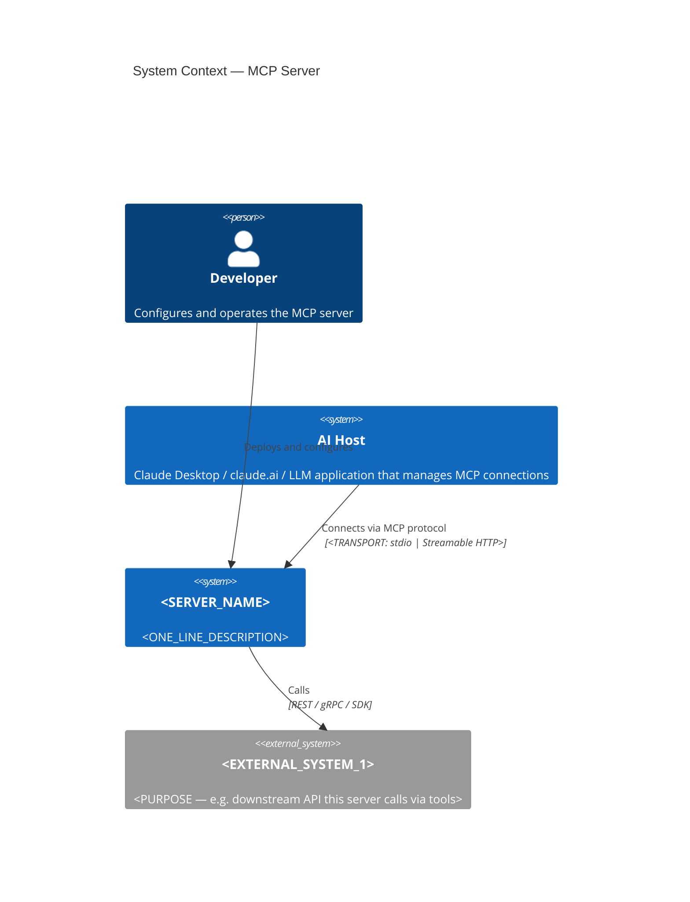
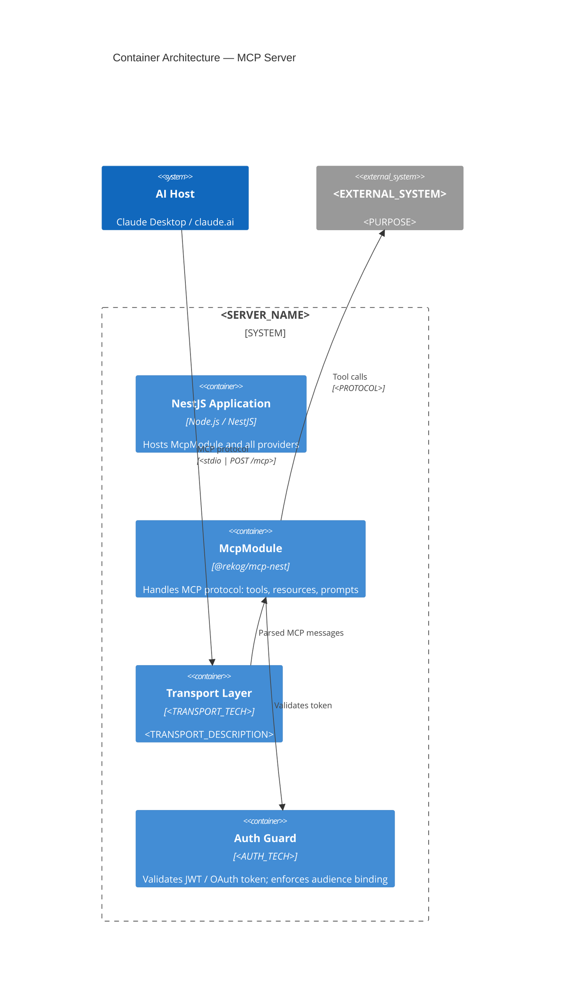
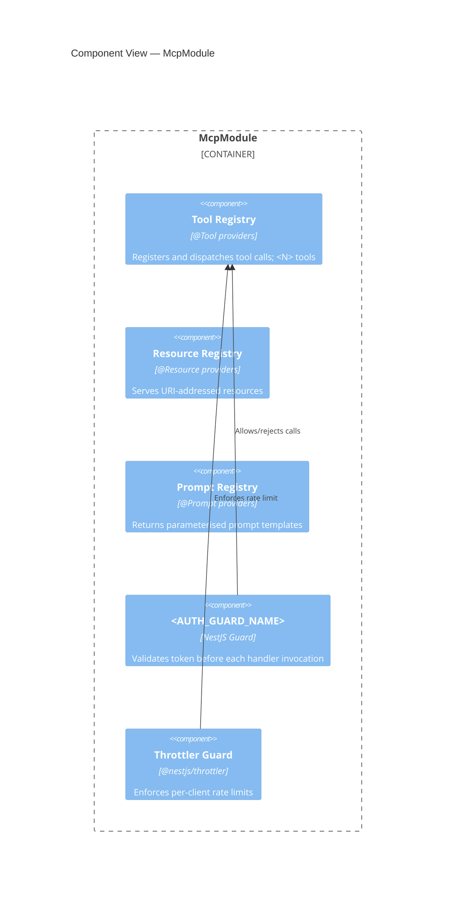
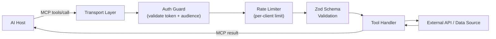
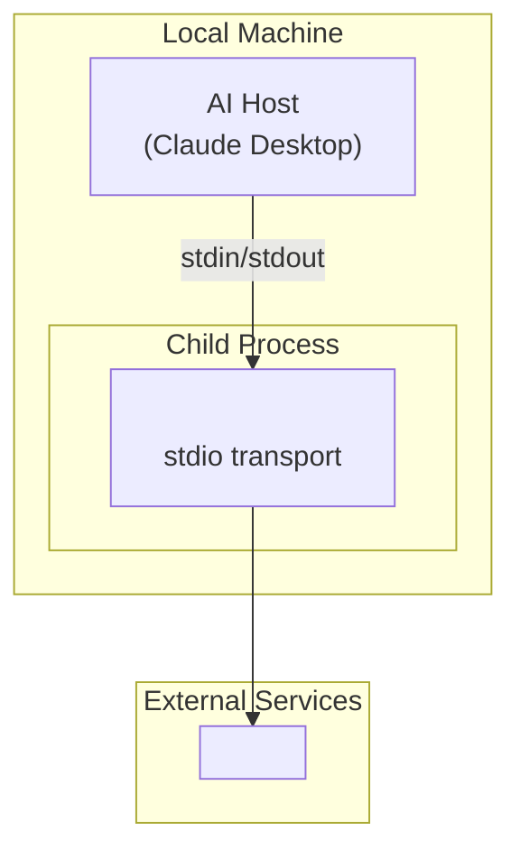
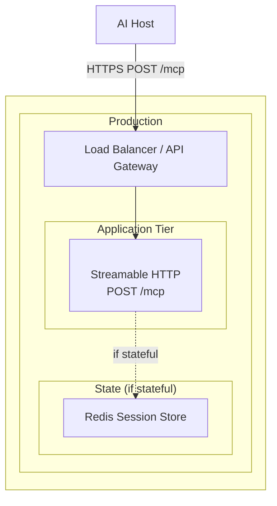

## Core Philosophy

Architecture documentation for an MCP server captures the **why** behind three decisions that generic documentation tools miss entirely: why a particular transport was chosen, how the tool/resource/prompt capability surface was designed, and how the server defends against MCP-specific threats at the architecture level. Every section must answer a specific question for a specific stakeholder. Document stable architectural facts — not tool implementations, handler logic, or Zod schema field names.

MCP servers have a distinct context diagram shape: the primary actor is an AI Host (Claude Desktop, claude.ai, or an LLM application), not a human end user. The system boundary contains NestJS containers that are invisible to generic architecture tools. Risks pre-populate from the MCP threat landscape (tool poisoning, prompt injection, confused-deputy token passthrough) rather than from generic web-application risk tables.

Security documentation lives in `docs/security/` (generated by `mcp-security-docs`), not in `docs/architecture/`. The architecture tree links to it rather than duplicating it.

---

## Mode: GENERATE

### GENERATE Checklist

- [ ] Step 1 — Detect project state & MCP architecture
- [ ] Step 2 — Load references
- [ ] Step 3 — Analyse and plan generation
- [ ] Step 4 — Generate all documentation files
- [ ] Step 5 — Generate MCP-specific Mermaid diagrams
- [ ] Step 6 — Generate MCP-specific ADR stubs
- [ ] Step 7 — Write files and print guidance

---

### Step 1 — Detect Project State and MCP Architecture

#### Phase A — Existing docs inventory

Search for: `docs/architecture/`, `docs/arch/`, `docs/design/`, `architecture/`, `ARCHITECTURE.md`

Existing docs found?
  └─ YES → Classify each canonical file against the 10-section output structure:
           - `[present + complete]` = substantive content, > 200 words (excluding code/Mermaid), < 2 TODOs/PLACEHOLDERs
           - `[present + stub]`    = exists but < 200 words, only headings, or > 2 PLACEHOLDER/TODO/TBD occurrences
           - `[missing]`           = not present at all
           Set `MODE = "gap-fill"`. Produce gap report (Step 3) before writing anything.
  └─ NO  → Set `MODE = "greenfield"`. Generate all files from scratch.

Search for existing ADRs: `docs/adr/`, `docs/decisions/`, any `*adr*` directory.
  └─ Found → Set `ADR_OFFSET = (highest existing number + 1)`
  └─ Not found → Set `ADR_OFFSET = 1`

#### Phase B — MCP server detection

```
package.json "dependencies" contains "@rekog/mcp-nest" or "@modelcontextprotocol/sdk"?
  └─ YES → confirmed MCP server; set MCP_CONFIRMED = true

src/**/*.tool.ts files present?
  └─ YES → MCP_CONFIRMED = true; note tool file count

mcp.json at repo root?
  └─ YES → MCP_CONFIRMED = true; read server name/description if present

MCP_CONFIRMED = false after all checks?
  └─ Warn: "No MCP server indicators found — generating generic NestJS architecture docs.
            Add @rekog/mcp-nest or @modelcontextprotocol/sdk to confirm MCP server."
```

#### Phase C — NestJS detection

```
package.json contains "@nestjs/core" or "@nestjs/common"?
  └─ YES → NESTJS = true; note version
  └─ NO  → NESTJS = false; note: NestJS-specific container/component detail will be generic
```

#### Phase D — Transport detection

```
Grep src/ for "StdioServerTransport" or "STREAMABLE_HTTP" or "stdio":
  └─ StdioServerTransport found → TRANSPORT = "stdio"
  └─ STREAMABLE_HTTP found      → TRANSPORT = "streamable-http"
  └─ Neither found              → TRANSPORT = "unknown"

Grep McpModule.forRoot config for transport array:
  └─ Confirm or refine above result
```

#### Phase E — Statefulness detection

```
Grep McpModule.forRoot for "statelessMode":
  └─ statelessMode: true  → STATEFUL = false
  └─ statelessMode: false → STATEFUL = true
  └─ Not found            → STATEFUL = "unknown"

Grep for "sessionIdGenerator":
  └─ Found → STATEFUL = true (confirms stateful session management)
```

#### Phase F — Capability scan

```
Grep src/ for "@Tool(" decorator → NOTE_TOOLS = count of matches
Grep src/ for "@Resource(" decorator → NOTE_RESOURCES = count of matches
Grep src/ for "@Prompt(" decorator → NOTE_PROMPTS = count of matches
Grep src/ for "sampling" in capability config → NOTE_SAMPLING = true/false
```

#### Phase G — Auth detection

```
package.json contains "passport-jwt" or "@nestjs/jwt" or "jwks-rsa"?
  └─ YES → AUTH = "jwt"
package.json contains "@nestjs/passport"?
  └─ YES → note auth framework
Grep src/ for "TechzoneAuthGuard" or "AuthGuard":
  └─ Found → AUTH_GUARD = guard name found
```

#### Phase H — Cross-cutting scan

```
package.json contains "@nestjs/throttler"?     → THROTTLER = true
package.json contains "@opentelemetry"?         → OTEL = true
package.json contains "nestjs-pino" or "pino"? → PINO = true
package.json contains "ioredis" or "redis"?     → REDIS = true
package.json contains "@nestjs/terminus"?       → HEALTH = true
```

#### Phase I — Deployment scan

```
Dockerfile present?                    → DEPLOY_CONTAINER = true
k8s/ or kubernetes/ or manifests/ dir? → DEPLOY_K8S = true
.github/workflows/ present?            → CICD = "GitHub Actions"
.gitlab-ci.yml present?                → CICD = "GitLab CI"
*.tf files present?                    → IaC = "Terraform"; scan provider for cloud
cdk.ts present?                        → IaC = "AWS CDK"; CLOUD = "AWS"
```

**Hard rules — NEVER (Step 1):**
- Never skip Phase A. Always check for existing docs before generating anything.
- Never overwrite a `[present + complete]` file without explicit user confirmation.
- Never ask the user for information that can be determined from the filesystem.
- Never infer statefulness from business logic — only from McpModule config.

---

### Step 2 — Load References

```
Always load:
  references/universal.md
  references/mcp-c4-patterns.md
  references/mcp-adrs.md
  references/mcp-cross-cutting.md
```

---

### Step 3 — Analyse and Plan Generation

#### 3a. Gap report (gap-fill mode only)

Before writing any file, output:

```
Found N existing files in docs/architecture/.

  Complete (will skip):    [list]
  Stub (will enrich):      [list]
  Missing (will generate): [list]
```

Do not ask permission to proceed unless a `[present + complete]` file would be overwritten.

#### 3b. MCP ADR pre-fill scan

Identify which of the 6 MCP ADR topics have detectable evidence. For each with evidence:
- Status: `Proposed` (never `Accepted`)
- Include banner: `> ⚠️ INFERRED: This ADR was inferred from the codebase. Verify Context and Consequences before changing status to Accepted.`

Priority order for inferred ADRs:
1. Transport selection — if TRANSPORT != "unknown" (always infer if MCP_CONFIRMED)
2. Statefulness mode — if STATEFUL != "unknown"
3. OAuth / JWT strategy — if AUTH = "jwt"
4. Capability set — if NOTE_TOOLS > 0 or NOTE_RESOURCES > 0 or NOTE_PROMPTS > 0
5. Deployment model — if DEPLOY_CONTAINER or DEPLOY_K8S
6. Rate limiting strategy — if THROTTLER = true

Generate at most 6 ADR stubs. More unreviewed stubs create noise.

#### 3c. Enrichment rules (stub files in gap-fill mode)

```
Read existing file
  → Identify headings with substantive content (> 50 words below heading)
  → Preserve all existing content exactly
  → Generate new content only under empty or stub headings
  → Append "<!-- enriched by mcp-architecture-docs skill, YYYY-MM-DD -->" at bottom
```

---

### Step 4 — Generate All Documentation Files

Always generate the full suite. In gap-fill mode, skip `[present + complete]` and enrich `[present + stub]`.

**Output structure:**

```
docs/architecture/
  README.md
  01-system-context.md
  02-container-architecture.md
  03-component-view.md
  04-data-architecture.md
  05-deployment.md
  06-cross-cutting-concerns.md
  07-quality-and-nfrs.md
  08-technology-stack.md
  09-risks-and-debt.md
  10-glossary.md
  adr/
    0001-record-architecture-decisions.md
    template.md
    000N-<inferred-decision>.md    (up to 6 inferred stubs)
  .checklist.md
```

**Tense by mode:**
- `greenfield`: future tense — "This server will..."
- `gap-fill`: declarative present — "This server..."

---

**Required content per section:**

`README.md`
- Navigation table: link | one-line description | primary audience for each section
- Server name (from mcp.json, package.json `name`, or directory name) and one-paragraph overview
- How to keep docs current: triggers for update (new tool added, transport change, auth strategy change, deployment change)
- Link to `docs/security/` if `mcp-security-docs` output is present

`01-system-context.md`
- **Audience:** business stakeholders and architects
- C4Context diagram (see Step 5)
- External actors table: Name | Type | Interaction
  - Primary actor: AI Host (Claude Desktop / claude.ai / LLM application) — type: System (not Person)
  - Human actor (if any): developer or end user triggering the AI Host
  - External systems: APIs, databases, services this MCP server calls via tools
- Server purpose statement (2–3 sentences: what tools/resources it exposes and why)
- Business context: why this MCP server exists, what workflow it enables

`02-container-architecture.md`
- **Audience:** architects and engineers
- C4Container diagram (see Step 5)
- Container responsibility table: Container | Technology | Responsibility | Entry Point
  Include rows for: NestJS Application, McpModule, Transport Layer, Auth Layer (if detected), Rate Limiter (if detected), Session Store (if STATEFUL)
- Communication pattern summary: how AI Host connects (stdio / Streamable HTTP POST /mcp), protocol version (MCP 2025-11-25), auth flow (if applicable)

`03-component-view.md`
- **Audience:** engineers
- C4Component diagram for the McpModule container (see Step 5)
- Component table: Component | Responsibility | Key File(s)
  Include rows for: Tool Registry (N tools detected), Resource Registry (if resources detected), Prompt Registry (if prompts detected), Auth Guard (if detected), Throttler Guard (if detected), Health Controller (if terminus detected)
- Dependency direction rule: Guards → Handlers; Handlers must not import Guards directly
- Note: if NOTE_TOOLS > 10, show tool groups by domain rather than individual tools

`04-data-architecture.md`
- Tool input/output schema registry: how tool input schemas are defined (Zod, detected version)
- Session state store (only if STATEFUL = true): storage type, session ID format, TTL policy
- Persistent data stores: table of any databases detected (from package.json scan)
- Data flow: tool call input → Zod validation → handler → response serialisation
- Schema management: note how Zod schemas are versioned or changed

`05-deployment.md`
- Deployment architecture diagram (see Step 5)
- Environments table: Environment | Purpose | Endpoint | Trigger
- Transport-aware deployment notes:
  - stdio: "Runs as a child process. No network exposure. Auth via environment variables only."
  - Streamable HTTP: "Single POST /mcp endpoint. Stateless — no sticky sessions required unless STATEFUL=true."
- Scaling strategy based on STATEFUL flag and REDIS:
  - Stateless + no Redis: "Horizontally scalable — any replica handles any request."
  - Stateless + Redis throttler: "Horizontally scalable with shared rate limit state via Redis."
  - Stateful: "Sticky session routing required OR session store externalised. See 04-data-architecture.md."
- CI/CD pipeline summary (from detected CICD tool)

`06-cross-cutting-concerns.md`
- **One sub-section per detected concern.** If not detected, include heading with "Not yet implemented — see 09-risks-and-debt.md."
- Authentication & Authorisation: detected auth pattern, guard name, token source (header / env), audience binding rule
- Tool Schema Enforcement: Zod strict mode, input validation on every tool call, note: "schema changes are breaking changes"
- Audit Logging: which tool calls are logged, log level, structured fields (tool name, caller identity, timestamp, result status)
- Rate Limiting: per-client limits (if throttler detected), Redis backend note (if REDIS detected)
- Observability: OpenTelemetry span per tool call (if OTEL detected), structured logs (if PINO detected)
- Error Handling: how tool errors are surfaced to the AI Host (MCP error codes vs HTTP status)
- **Security documentation cross-reference:** "Full threat model, STRIDE analysis, and vulnerability disclosure process are in `docs/security/` — generate with `mcp-security-docs` if not present."

`07-quality-and-nfrs.md`
- Quality goals table: Goal | Measurable Target | Priority
  Pre-populate MCP-specific targets (all with TBD; replace with real measurements):
  - Tool call round-trip latency: TBD ms (p95)
  - Token validation overhead: TBD ms per request
  - Concurrent session limit (if stateful): TBD sessions
  - Rate limit threshold: TBD requests/min per client
  - Availability: TBD % uptime
- Constraints: MCP spec 2025-11-25 compliance, OAuth 2.1 mandatory for remote servers, token passthrough forbidden
- Add comment: `<!-- Replace TBD with real measurements — "fast" is not a target -->`

`08-technology-stack.md`
- Stack table: Layer | Technology | Version | Rationale
  Layers: Runtime, MCP Framework, Web Framework, Auth, Transport, Schema Validation, Rate Limiting, Observability, IaC, CI/CD
  Populate from package.json scan; Rationale column: `<TODO: document why chosen>`
- Note MCP spec target version: 2025-11-25

`09-risks-and-debt.md`
- Risk table: Risk | Likelihood (H/M/L) | Impact (H/M/L) | Mitigation Strategy
  Pre-populate with MCP-specific risks from `references/mcp-cross-cutting.md`:
  - Tool poisoning via hidden instructions in tool descriptions
  - Prompt injection via malicious tool response content
  - Confused-deputy / token passthrough (if AUTH detected)
  - Supply chain compromise via MCP SDK dependency
  - Session fixation (if STATEFUL and session IDs are not cryptographically random)
  - Broken object-level authorisation (if tools expose data without per-call auth checks)
  - Missing rate limiting allowing DoS (if THROTTLER = false)
- Technical debt prompts: "Known shortcuts:", "Tests missing for:", "Auth not yet implemented:"

`10-glossary.md`
- Pre-populate MCP glossary terms:
  - **MCP Host** — the AI application (e.g., Claude Desktop) that manages MCP client connections
  - **MCP Client** — protocol component inside the Host that connects to one MCP server
  - **MCP Server** — this service; exposes tools, resources, and prompts via MCP protocol
  - **Tool** — a function the AI can invoke; has a name, input schema, and handler
  - **Resource** — a URI-addressable data source the AI can read
  - **Prompt** — a parameterised template the AI can request
  - **Capability** — a declared feature set negotiated during `initialize` handshake
  - **Streamable HTTP** — MCP transport over `POST /mcp`; supports both JSON and SSE responses
  - **stdio** — MCP transport over stdin/stdout; used for local client-process servers
  - **Stateless mode** — server holds no per-session state; horizontally scalable
  - **Stateful mode** — server maintains session state; requires sticky routing or external store
  - **Tool poisoning** — attack where hidden instructions in tool descriptions manipulate AI behaviour
  - **Confused deputy** — attack where a proxy server is tricked into using ambient authority it holds
  - **Token passthrough** — forbidden pattern where a server forwards a received token to a downstream service without validating audience
- Supplement with domain terms inferred from tool/resource names in source files

---

### Step 5 — Generate Mermaid Diagrams (Native C4 Syntax)

Use Mermaid's native C4 diagram types. Every stub must be valid, parseable Mermaid. Placeholders are `<UPPERCASE_SNAKE_CASE>`. Every stub has a `<!-- TODO: replace placeholders with actual names -->` comment above it.

Populate `<SERVER_NAME>` from mcp.json, package.json `name`, or repository directory name.

**Context diagram — 01-system-context.md**

```
<!-- TODO: replace placeholders with actual names -->


Populate detected external systems from Phase B/G/H tool file scan (SDK imports in tool handlers).

**Container diagram — 02-container-architecture.md**

One `Container` node per major deployable unit or logical container. Show transport type on the AI Host → server relationship.

```
<!-- TODO: replace placeholders with actual names -->


Omit authGuard container if AUTH = false/unknown. Add `ContainerDb(sessionStore, ...)` if STATEFUL.

**Component diagram — 03-component-view.md**

Show internals of the McpModule container.

```
<!-- TODO: replace placeholders with actual names -->


Omit resourceRegistry if NOTE_RESOURCES = 0. Omit promptRegistry if NOTE_PROMPTS = 0.

**Data flow diagram — 04-data-architecture.md**

```
<!-- TODO: replace placeholders with actual tool name -->


**Deployment diagram — 05-deployment.md**

Adapt based on TRANSPORT and DEPLOY_* flags.

stdio deployment:

```
<!-- TODO: replace placeholders -->


Streamable HTTP deployment:

```
<!-- TODO: replace placeholders -->


**Diagram hard rules — NEVER:**
- Generate PlantUML — Mermaid only (renders natively on GitHub)
- Write an unclosed Mermaid fence block
- Include env variable names, JWT fields, or internal URL paths in diagrams
- Show `Person` for the AI Host at Context level — use `System` (the Host is a software system, not a human)
- Show tool implementation detail at container level — that belongs in component view

---

### Step 6 — Generate ADR Files

#### `adr/template.md`

Standard Nygard-format template. Same as `architecture-docs` skill template.

#### `adr/0001-record-architecture-decisions.md`

Pre-filled meta-ADR, status `Accepted`. Same as `architecture-docs` skill.

#### Inferred ADR stubs (up to 6)

Templates drawn from `references/mcp-adrs.md`. For each detected topic, generate a stub with:
- Status: `Proposed`
- Banner: `> ⚠️ INFERRED: This ADR was inferred from the codebase. Verify Context and Consequences before changing status to Accepted.`
- Context: what was detected (e.g., "StdioServerTransport found in src/main.ts")
- Decision: the observed choice
- Rationale: `<TODO: document why this was chosen over the alternative>`
- Consequences: starter list from `references/mcp-adrs.md` for the relevant topic

**Hard rules — NEVER (ADRs):**
- Set an inferred ADR to `Accepted` — always `Proposed`
- Generate more than 6 inferred stubs
- Edit an existing accepted ADR — create a superseding ADR instead

---

### Step 7 — Write Files and Report

Write all files to `docs/architecture/` from the project root.

After writing, generate `.checklist.md`:
- Every `<PLACEHOLDER>` across all files (file name + section)
- Every `TODO` in ADR files
- Every INFERRED ADR (file + current status)
- Every TBD in `07-quality-and-nfrs.md`
- Security docs cross-reference: "Run `mcp-security-docs` GENERATE mode to create `docs/security/` content"

**Post-write summary:**

```
MCP architecture documentation generated at docs/architecture/

Server: <SERVER_NAME>  |  Transport: <TRANSPORT>  |  Stateful: <STATEFUL>
Tools: <N>  |  Resources: <N>  |  Prompts: <N>

Files written:
  ✓ README.md
  ✓ 01-system-context.md          — C4Context: AI Host → MCP Server → <N> external systems
  ✓ 02-container-architecture.md  — C4Container: NestJS app, McpModule, <N> containers
  ✓ 03-component-view.md          — C4Component: <N> components in McpModule
  ✓ 04-data-architecture.md       — Schema registry, <STATEFUL_NOTE>
  ✓ 05-deployment.md              — Transport: <TRANSPORT>, Target: <DEPLOY_TARGET>
  ✓ 06-cross-cutting-concerns.md  — Auth, schema enforcement, audit logging, rate limiting, observability
  ✓ 07-quality-and-nfrs.md        — Requires team input for measurable targets
  ✓ 08-technology-stack.md        — <N> stack layers populated
  ✓ 09-risks-and-debt.md          — <N> MCP-specific risks pre-populated
  ✓ 10-glossary.md                — <N> MCP + domain terms
  ✓ adr/0001-record-architecture-decisions.md
  ✓ adr/template.md
  ✓ adr/000N-<title>.md           — INFERRED, requires review (×<N>)
  ✓ .checklist.md                 — <N> items require human input

Priority next steps:
  1. Review INFERRED ADRs in docs/architecture/adr/ — set status to Accepted or Rejected
  2. Replace <PLACEHOLDER> values in all diagram stubs with actual names
  3. Fill in 07-quality-and-nfrs.md with real, measurable targets
  4. Run mcp-security-docs GENERATE mode to create docs/security/ (threat model, SECURITY.md)
  5. Review .checklist.md for remaining gaps

Validate diagrams locally:
  npx @mermaid-js/mermaid-cli -i docs/architecture/02-container-architecture.md -o /tmp/diagram.png
```

---

## Mode: AUDIT

### AUDIT Checklist

- [ ] Step A1 — Inventory existing docs/architecture/ files
- [ ] Step A2 — Score MCP-specific C4 diagram coverage
- [ ] Step A3 — Score MCP-specific section content coverage
- [ ] Step A4 — Score ADR coverage
- [ ] Step A5 — Emit findings report with remediation guidance

---

### Step A1 — Inventory Existing Files

Check `docs/architecture/` and produce:

| File | Status (complete / stub / missing) |
|------|------------------------------------|
| README.md | ? |
| 01-system-context.md | ? |
| 02-container-architecture.md | ? |
| 03-component-view.md | ? |
| 04-data-architecture.md | ? |
| 05-deployment.md | ? |
| 06-cross-cutting-concerns.md | ? |
| 07-quality-and-nfrs.md | ? |
| 08-technology-stack.md | ? |
| 09-risks-and-debt.md | ? |
| 10-glossary.md | ? |
| adr/0001-record-architecture-decisions.md | ? |

---

### Step A2 — Score MCP-specific C4 Diagram Coverage

| Check | Pass condition | Severity if failing |
|-------|---------------|---------------------|
| Context diagram present | 01-system-context.md contains `C4Context` block | HIGH |
| AI Host shown as System (not Person) | Context diagram uses `System(aiHost` not `Person(aiHost` | MEDIUM |
| Transport labeled on AI Host → server relationship | Context or Container diagram has `stdio` or `POST /mcp` on Rel | MEDIUM |
| Container diagram present | 02-container-architecture.md contains `C4Container` block | HIGH |
| McpModule shown as container | Container diagram includes McpModule or equivalent | HIGH |
| Auth guard shown (if auth detected) | Container diagram has auth container or component | MEDIUM |
| Component diagram present | 03-component-view.md contains `C4Component` block | MEDIUM |
| Tool registry shown in components | Component diagram mentions tool registry or @Tool providers | MEDIUM |
| No placeholders remaining | No `<UPPERCASE_SNAKE_CASE>` patterns in any diagram | LOW |

---

### Step A3 — Score MCP-specific Section Content Coverage

| Code | Control | Check | Severity if failing |
|------|---------|-------|---------------------|
| MA-01 | Tool/resource capability coverage | 02-container-architecture.md documents tool/resource/prompt count | MEDIUM |
| MA-02 | Transport documented | 05-deployment.md or 02 states stdio vs Streamable HTTP | HIGH |
| MA-03 | Statefulness documented | 04 or 02 states stateless vs stateful and implications | MEDIUM |
| MA-04 | Auth cross-cutting concern | 06-cross-cutting-concerns.md has Authentication section | HIGH |
| MA-05 | Tool schema enforcement documented | 06 mentions Zod or schema validation | MEDIUM |
| MA-06 | Audit logging policy | 06 states which tool calls are logged | MEDIUM |
| MA-07 | MCP risks in 09 | 09-risks-and-debt.md mentions tool poisoning or prompt injection | HIGH |
| MA-08 | MCP glossary in 10 | 10-glossary.md defines Tool, Resource, MCP Host, Capability | MEDIUM |
| MA-09 | Security docs cross-reference | 06 links to docs/security/ or mcp-security-docs | MEDIUM |
| MA-10 | NFRs have measurable targets | 07-quality-and-nfrs.md has no TBD remaining | LOW |

---

### Step A4 — Score ADR Coverage

| ADR topic | Pass condition | Severity if failing |
|-----------|---------------|---------------------|
| Transport selection | ADR file titled *transport* or *stdio* or *streamable* present | HIGH |
| Statefulness mode | ADR file titled *stateless* or *stateful* or *session* present | MEDIUM |
| OAuth / JWT strategy | ADR file titled *oauth* or *auth* or *jwt* present | MEDIUM |
| Capability set | ADR file titled *capability* or *tools* present | LOW |

---

### Step A5 — Emit Findings Report

Output a findings table. For each `[HIGH]` and `[CRITICAL]` finding provide:
- One paragraph explaining why the gap matters for an MCP server
- Exact remediation (e.g., "Run GENERATE mode" or specific section content to add)

**Severity definitions:**
- `[CRITICAL]` — MCP server has no architecture docs at all, or transport/auth is completely undocumented
- `[HIGH]` — A key MCP-specific concern (transport, auth, tool risks) is missing from otherwise present docs
- `[MEDIUM]` — An MCP-specific best practice is absent; docs are technically present but MCP-unaware
- `[LOW]` — A quality improvement; docs meet baseline but lack measurable targets or complete glossary

### AUDIT Findings Table

| Code | Severity | Check | File | Finding | Fix |
|------|----------|-------|------|---------|-----|
| _populated from Steps A2–A4_ | | | | | |

---

## Reference Files

- `references/universal.md` — C4 model principles for MCP; ADR format (Nygard); MCP spec 2025-11-25 key architecture facts; diagram hard rules; living documentation update triggers
- `references/mcp-c4-patterns.md` — Standard MCP diagram patterns for each C4 level; anti-patterns specific to MCP documentation; AI Host vs human actor distinction; transport labelling conventions
- `references/mcp-adrs.md` — Six MCP-specific ADR templates with pre-filled Context, Consequences starters, and alternatives to evaluate
- `references/mcp-cross-cutting.md` — MCP cross-cutting concern content library: OAuth 2.1, tool poisoning, prompt injection, audit logging, rate limiting, observability, security docs integration
