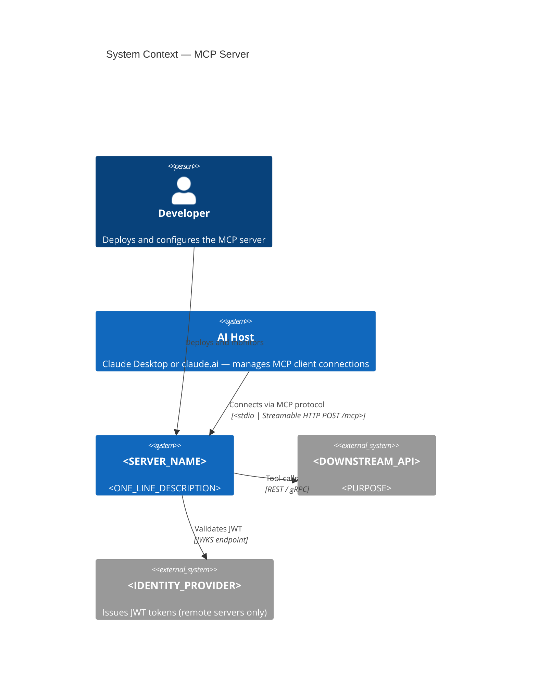
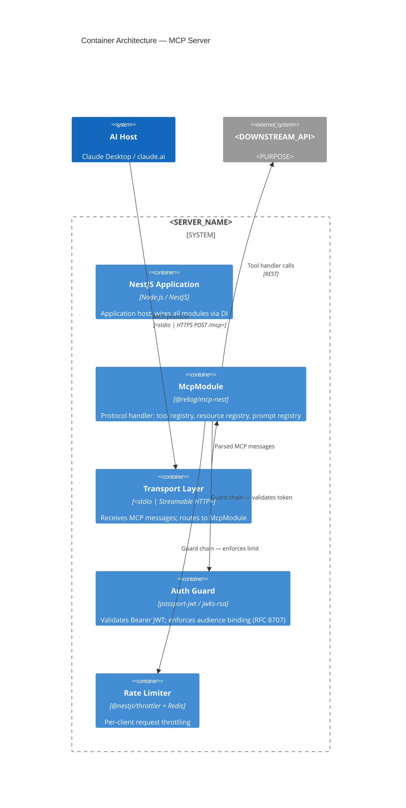
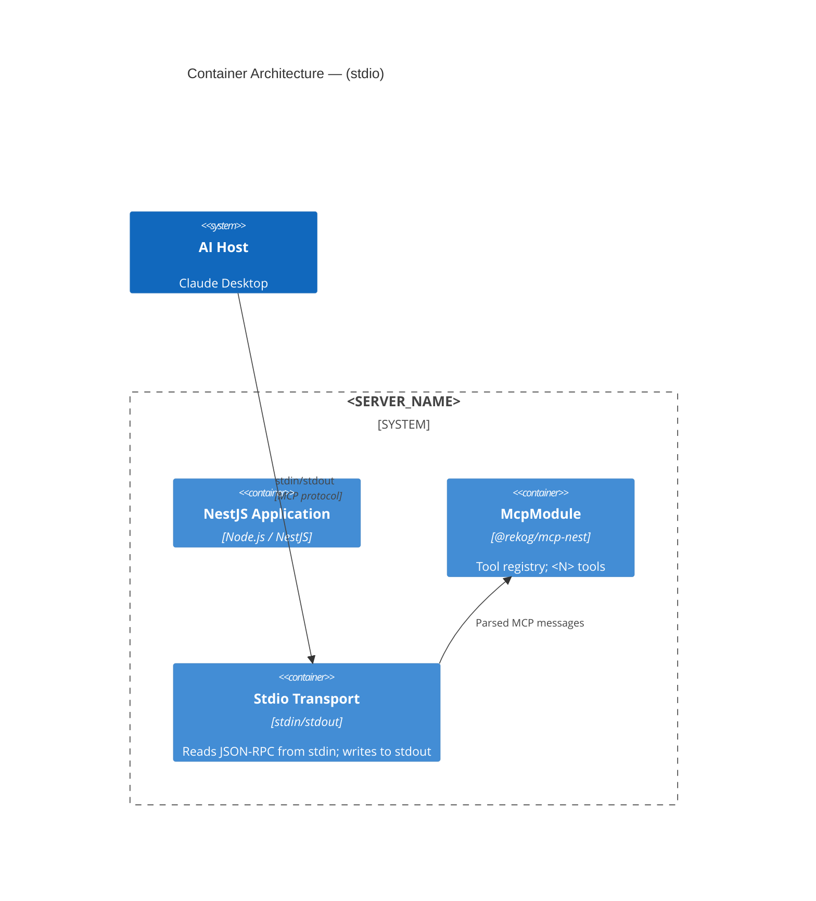
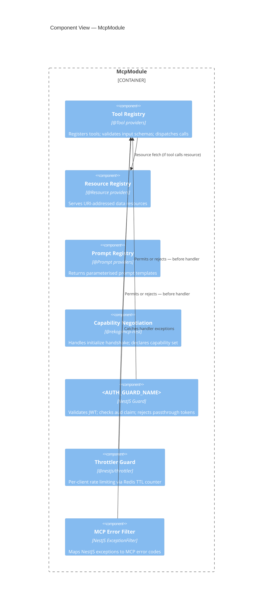
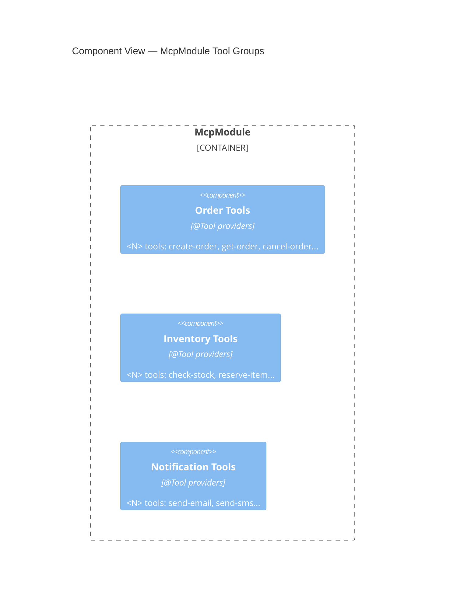
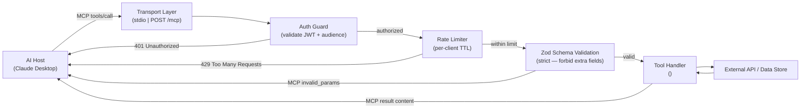
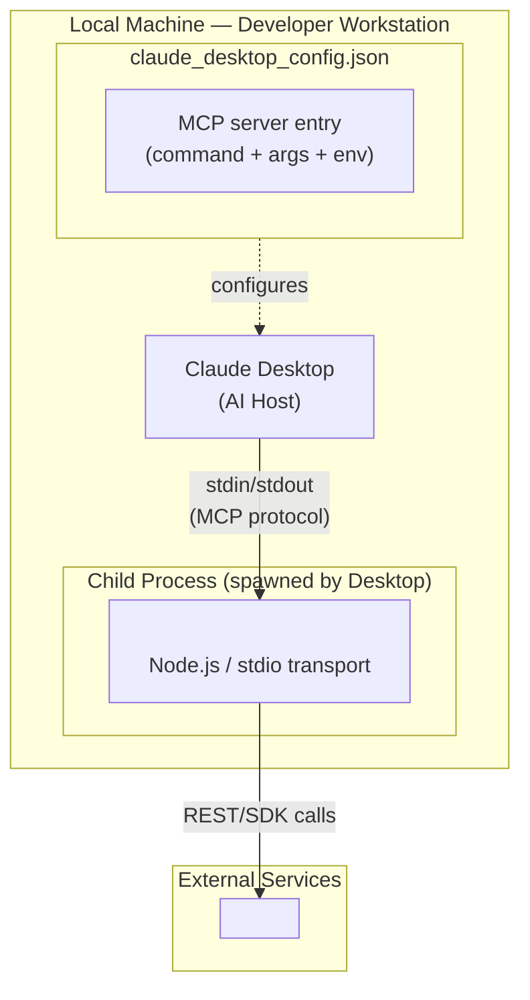
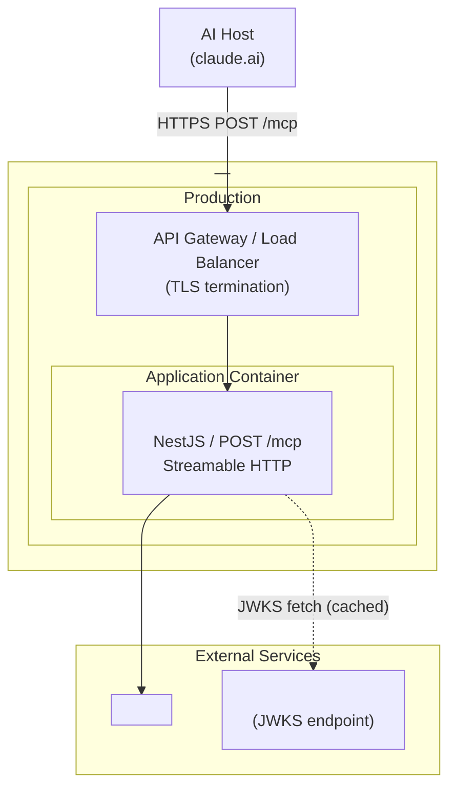
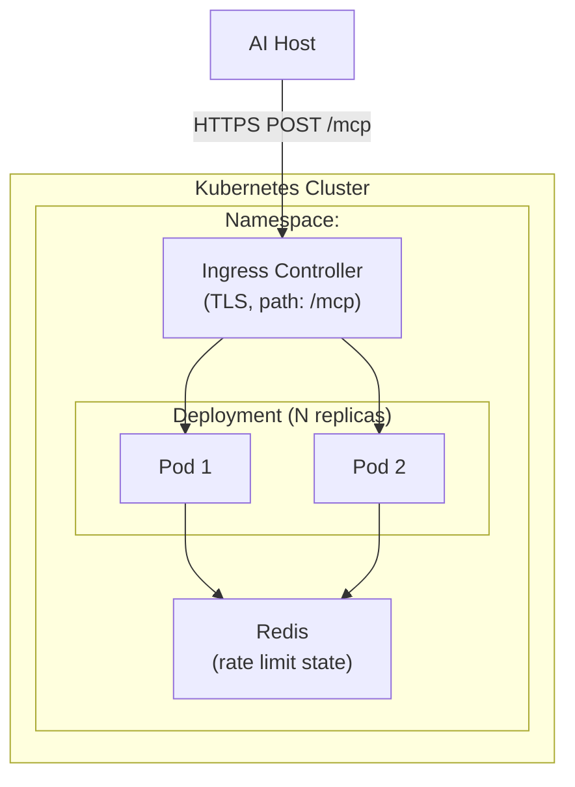

# MCP C4 Diagram Patterns

Standard diagram shapes, conventions, and anti-patterns for documenting NestJS MCP servers using the C4 model.

---

## Level 1 — Context Diagram

### Who belongs in an MCP context diagram

| Actor | Type | Notes |
|-------|------|-------|
| AI Host (Claude Desktop, claude.ai, LLM app) | `System` | Primary consumer of the MCP server — this is software, not a human |
| Developer / Operator | `Person` | Secondary actor; configures, deploys, monitors the server |
| End user (if applicable) | `Person` | Human who indirectly benefits via the AI Host; show only if the business context requires it |
| External APIs the server calls via tools | `System_Ext` | Downstream services invoked from tool handlers |
| IdP / Auth server (if OAuth) | `System_Ext` | Issues JWT tokens validated by the MCP server |

### Standard MCP context pattern



**What to omit at L1:**
- Individual tool names or counts
- JWT claims or token detail
- Internal module names
- Transport protocol headers or HTTP status codes

---

## Level 2 — Container Diagram

### Standard NestJS MCP container layout



### Stateful server additions

Add a session store container when `statelessMode: false`:

```mermaid
ContainerDb(sessionStore, "Session Store", "Redis", "Holds per-client MCP session state; TTL-bounded")
Rel(mcpModule, sessionStore, "Reads/writes session", "ioredis")
```

### stdio-only server (minimal)

For local-only stdio servers without auth or rate limiting:



---

## Level 3 — Component Diagram

### McpModule internals



**Omit components not present:** skip `resourceRegistry` if no `@Resource` providers, `promptRegistry` if no `@Prompt` providers, `throttleGuard` if no `@nestjs/throttler`.

### Tool grouping (> 10 tools)

When `NOTE_TOOLS > 10`, group tools by domain rather than listing individually:



---

## Data Flow Diagram (Tool Call Lifecycle)



---

## Deployment Diagram Variants

### stdio (local)



### Streamable HTTP — container (single instance)



### Streamable HTTP — Kubernetes (stateless + Redis)



---

## Anti-Patterns

| Anti-pattern | Why wrong | Fix |
|-------------|-----------|-----|
| `Person(aiHost, "AI Host", ...)` at L1 | The AI Host is a software system, not a human | Use `System(aiHost, ...)` |
| Showing tool implementation code in container diagram | That's L4 (code level); containers show deployable units | Move to L3 component or remove |
| Conflating MCP Client and MCP Host | Client is the protocol component inside the Host; they're not the same | Show AI Host as a single System; note internally it has a Client |
| Omitting transport protocol label on Host → Server arrow | Transport choice is architecturally significant | Always label the `Rel` with `stdio` or `Streamable HTTP / POST /mcp` |
| Showing JWT fields or header names in diagram | Volatile implementation detail | Describe as "Validates Bearer JWT" in component description |
| Drawing L1 context with internal module names | Context is stakeholder-level; no internals | Remove until L2 |
| Using PlantUML | Does not render natively on GitHub | Mermaid only |
| Unclosed Mermaid fence | Breaks rendering of the entire file | Always close ` ``` ` fences |
