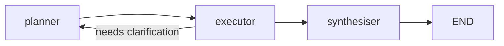

# Project Types Reference

Detection logic, section configuration, and content emphasis for each of the 6 supported project
types. Used by the readme-generation skill to select and prioritize sections.

---

## Detection Decision Tree

```
Step 1 — Check package.json
  Does package.json have a "bin" field?
    └─ YES → CLI Tool (Node.js)
  Does package.json exist without "bin"?
    Does it declare web framework dependencies?
      (react, vue, next, nuxt, svelte, angular, express, fastify, koa, hapi)
      └─ YES → Web Application or API
      └─ NO  → Check for agent dependencies (Step 1.5 below)

Step 1.5 — Check for AI Agent signals (BEFORE ML/Data Science and Python library checks)
  Does package.json declare agent framework dependencies?
    (@langchain/langgraph, @langchain/core, langchain)
      └─ YES → AI Agent (TypeScript/JavaScript)
  Does langgraph.json exist in the project root?
    └─ YES → AI Agent (Python — LangGraph Platform project)
  Do pyproject.toml, setup.py, setup.cfg, or requirements.txt declare agent dependencies?
    (langgraph, langchain, langchain-core, crewai, autogen, pyautogen, pydantic-ai, openai-agents)
      └─ YES → Disambiguation required:
                Does the project have a proper PyPI build-system AND version AND publish metadata?
                  └─ YES (packaged for distribution) → Library (Python) — apply agent-specific
                     section guidance from Type 6 in the API and Usage sections
                  └─ NO  (application, not a published package) → AI Agent (Python)

Step 2 — Check for ML/Data Science signals (check before Python library)
  Are there *.ipynb files?
    └─ YES → ML / Data Science
  Are there both a requirements.txt (or environment.yml) AND a notebooks/ or data/ directory?
    └─ YES → ML / Data Science

Step 3 — Check Python package files
  Does pyproject.toml, setup.py, or setup.cfg exist?
    Does it declare a console_scripts entry point?
      └─ YES → CLI Tool (Python)
      └─ NO  → Library (Python)

Step 4 — Check Rust
  Does Cargo.toml have a [[bin]] section?
    └─ YES → CLI Tool (Rust)
    └─ NO  → Library (Rust)

Step 5 — Check Go
  Is there a main package at the project root or in cmd/?
    └─ YES → CLI Tool (Go)
    └─ NO  → Library (Go)

Step 6 — Container / cloud signals
  Is there a Dockerfile, docker-compose.yml, or k8s manifest?
    └─ YES → Web Application or API

Step 7 — Ambiguous
  Ask the user: "I couldn't determine the project type automatically. Is this a
  library, CLI tool, web application, API, ML/data science project, or an AI agent /
  agentic workflow (built with LangGraph, CrewAI, AutoGen, Pydantic AI, etc.)?"
```

---

## Type 1: Library / Package

A reusable package that other developers install as a dependency.

**Examples:** NumPy, Lodash, Tokio, fastparquet, go-chi

### Required sections

| Section | Notes |
|---------|-------|
| Title | Match the exact package name (npm/PyPI/crates.io) |
| Short description | Describe what problems the library solves |
| Installation | Lead with package manager command; include minimum runtime version |
| Usage | Show import + 2–3 most common function calls with output |
| API | Document every exported function/class with signature and parameters |
| Contributing | At minimum, link to CONTRIBUTING.md |
| License | Final section; SPDX identifier + copyright owner |

### Strongly recommended sections

| Section | Why |
|---------|-----|
| Badges | Version, downloads, coverage, and CI status signal active maintenance |
| Highlights | What makes this library better or different from alternatives |
| Quick Start | Help users see value immediately before reading the full API |
| Compatibility table | Which language/runtime versions are supported |

### Content emphasis

- **Installation is critical.** Many library users skim directly to it. Make the single-line
  install command the very first thing in the section.
- **API documentation depth matters.** For libraries, the API section is the core value of the
  README. Document all public exports with types, defaults, and return values.
- **Show real data shapes.** When showing usage examples, use real column names and realistic
  data — not `col1`, `col2`, `value1`.
- **Compatibility matrix.** Show which versions of the runtime, operating systems, or dependent
  libraries are supported. A table works well:

```markdown
| Python | Status |
|--------|--------|
| 3.10   | ✅ Supported |
| 3.11   | ✅ Supported |
| 3.12   | ✅ Supported |
| 3.9    | ⚠️ Best effort |
| <3.9   | ❌ Not supported |
```

### Sections to omit or de-emphasize

- Screenshots (not useful for a code library)
- Deployment instructions (users deploy their own apps; this is a dependency)
- Architecture diagrams (belong in the project docs, not the README)

---

## Type 2: CLI Tool

A command-line application that users install globally and run as a command.

**Examples:** ripgrep, bat, ffmpeg, gh, jq, kubectl

### Required sections

| Section | Notes |
|---------|-------|
| Title | Match the command name exactly as typed in the shell |
| Short description | Describe what the tool does in one sentence |
| Installation | Multiple methods (homebrew, apt, pip, cargo install, etc.) |
| Usage | Show the full command with real flags and real expected output |
| Contributing | Even a one-liner invites collaboration |
| License | Final section |

### Strongly recommended sections

| Section | Why |
|---------|-----|
| Badges | CI, release version, platform support |
| Quick Start | Show the one command that gets value immediately |
| Configuration | Document every flag, env var, and config file option |
| Examples | Real-world commands covering the 4–5 most common use cases |

### Content emphasis

- **The tool name IS the brand.** The title must match exactly what users type in the shell.
  If the binary is `rg`, the README title should be `rg` (or `ripgrep (rg)` to aid discovery).
- **Show `--help` output.** Include a code block with the actual `--help` output so users can
  see all flags at a glance without running the tool:

```markdown
```bash
mytool --help
# Usage: mytool [options] <input>
#
# Options:
#   -o, --output <file>   Output file (default: stdout)
#   -f, --format <fmt>    Output format: json, csv, table (default: json)
#   -v, --verbose         Enable verbose logging
#   -h, --help            Show this help message
```
```

- **Installation must cover multiple platforms.** CLI users are on macOS, Linux, and Windows.
  Show at least two installation methods (e.g., Homebrew + direct binary download, or
  pip + cargo install).
- **Real command examples.** Show full commands with real file names and real flag values.
  Include the expected terminal output (or a truncated version with `...` clearly noted).
- **Flag documentation in a table.** List every flag with its short form, long form, default,
  and description. Users read this section constantly.

### Sections to omit or de-emphasize

- API section (CLIs don't have programmatic APIs — if they do, call it "Scripting" or "Integration")
- Compatibility tables for language versions (CLI users care about OS and arch, not Python/Node versions)

---

## Type 3: Web Application

A frontend or full-stack application deployed to a URL.

**Examples:** Grafana, Mattermost, Gitea, a React SPA, a Next.js app

### Required sections

| Section | Notes |
|---------|-------|
| Title | Project name |
| Short description | What the app does and who it's for |
| Installation | How to run it locally (dev environment setup) |
| Usage | How to use the app — screenshots are essential here |
| Contributing | Development setup instructions |
| License | Final section |

### Strongly recommended sections

| Section | Why |
|---------|-----|
| Badges | CI/CD status, deployment status, version |
| Highlights | Key features of the application |
| Visuals | Screenshots or animated GIFs — critical for web apps |
| Quick Start | Minimal local dev setup (`docker-compose up`) |
| Configuration | Environment variables, config files |
| Deployment | How to deploy to production |

### Content emphasis

- **Visuals are not optional.** Web applications live and die by their UI. A screenshot or
  short GIF is worth a page of text. Place at least one screenshot in the Highlights or
  Quick Start section.

```markdown

```

- **Separate local dev from production deployment.** These are different audiences:
  - **Installation** = getting it running locally for development
  - **Deployment** = running it in production (Kubernetes, Docker, cloud)
- **Environment variable documentation.** Web apps almost always have configuration via `.env`.
  Document every variable in the Configuration section:

```markdown
| Variable | Default | Required | Description |
|----------|---------|----------|-------------|
| `DATABASE_URL` | — | Yes | PostgreSQL connection string |
| `SECRET_KEY` | — | Yes | Django/Flask secret key for session signing |
| `REDIS_URL` | `redis://localhost:6379` | No | Cache backend |
| `DEBUG` | `false` | No | Enable debug mode (never use in production) |
```

- **Tech stack overview.** Briefly list the primary technologies used — it helps contributors
  assess whether they can help:

```markdown
Built with [Next.js](https://nextjs.org/), [PostgreSQL](https://www.postgresql.org/),
[Tailwind CSS](https://tailwindcss.com/), and [Redis](https://redis.io/).
```

### Sections to omit or de-emphasize

- Detailed API reference (belongs in separate API docs or a Swagger/OpenAPI spec)

---

## Type 4: API / Web Service

A backend service exposing HTTP, GraphQL, or gRPC endpoints consumed by other software.

**Examples:** REST APIs, GraphQL servers, gRPC microservices, webhook receivers

### Required sections

| Section | Notes |
|---------|-------|
| Title | Service name |
| Short description | What the API does and who consumes it |
| Installation | How to run the service locally |
| Usage | Authentication setup + 2–3 example API calls |
| API | Endpoint reference or link to OpenAPI spec |
| Contributing | At minimum, how to run tests locally |
| License | Final section |

### Strongly recommended sections

| Section | Why |
|---------|-----|
| Badges | CI, version |
| Quick Start | Fastest path to a real API call |
| Authentication | Deserves its own subsection — critical for API users |
| Error codes | API users need to know what errors they'll encounter |
| Rate limiting | Document limits upfront to prevent surprises |

### Content emphasis

- **Authentication first.** Every authenticated API call requires auth setup. Document this
  before the endpoint examples so readers aren't blocked:

```markdown
### Authentication

All requests require an `Authorization` header with a Bearer token:

```bash
curl -H "Authorization: Bearer $API_TOKEN" https://api.example.com/v1/status
```

Obtain a token at https://app.example.com/settings/api-keys.
```

- **Show real requests and responses.** Use `curl` as the baseline (universal), then optionally
  show a language SDK example:

```markdown
```bash
curl -X POST https://api.example.com/v1/users \
  -H "Authorization: Bearer $API_TOKEN" \
  -H "Content-Type: application/json" \
  -d '{"name": "Alice", "email": "alice@example.com"}'
```

```json
{
  "id": "usr_01H8X7KQZMKJP3NV5CZRHF4XGT",
  "name": "Alice",
  "email": "alice@example.com",
  "created_at": "2024-03-15T10:22:04Z"
}
```
```

- **Error table.** Document the error codes and their meanings:

```markdown
| Status | Code | Description |
|--------|------|-------------|
| 400 | `invalid_request` | Missing or malformed request body |
| 401 | `unauthorized` | Missing or invalid API token |
| 404 | `not_found` | The requested resource does not exist |
| 429 | `rate_limited` | Exceeded rate limit (see headers for reset time) |
| 500 | `internal_error` | Server error — contact support if persistent |
```

- **Link to OpenAPI / Swagger spec** if one exists — do not replicate it in the README.

### Sections to omit or de-emphasize

- Screenshots of a UI (APIs don't have one)
- Compatibility matrices for language versions (document SDK versions separately)

---

## Type 5: ML / Data Science

A machine learning model, dataset, notebook collection, or data science pipeline.

**Examples:** Hugging Face model repos, Kaggle competition repos, research paper code, MLflow projects

### Required sections

| Section | Notes |
|---------|-------|
| Title | Model or project name |
| Short description | What the model/pipeline does and what problem it solves |
| Installation | Dependencies, Python version, GPU requirements |
| Usage | How to run inference or reproduce the pipeline |
| Contributing | Even research repos benefit from contributor guidelines |
| License | Final section — also note dataset license if different |

### Strongly recommended sections

| Section | Why |
|---------|-----|
| Badges | CI, model size, framework version |
| Highlights | Key capabilities, benchmark results summary |
| Quick Start | Minimal inference example (copy-paste ready) |
| Dataset | Where to get the data, its license, how to preprocess |
| Model Architecture | High-level description and diagram if helpful |
| Training | How to train/reproduce from scratch |
| Results | Performance metrics on standard benchmarks |
| Citation | BibTeX block for academic use |

### Content emphasis

- **Quick Start must include inference.** The most common use of an ML README is by someone
  who wants to use the model, not train it. Put the inference example first:

```markdown
## Quick Start

```python
from transformers import AutoTokenizer, AutoModelForSequenceClassification
import torch

tokenizer = AutoTokenizer.from_pretrained("org/model-name")
model = AutoModelForSequenceClassification.from_pretrained("org/model-name")

inputs = tokenizer("The product arrived damaged.", return_tensors="pt")
with torch.no_grad():
    logits = model(**inputs).logits

predicted_class = logits.argmax().item()
print(model.config.id2label[predicted_class])
# NEGATIVE
```
```

- **Results / benchmarks.** Report performance on standard datasets with exact metric values.
  State clearly what was measured, on which dataset split, and with which evaluation code:

```markdown
## Results

Evaluated on the SST-2 test split using the official evaluation script.

| Model | Accuracy | F1 |
|-------|----------|----|
| This model | **94.2%** | **93.8%** |
| BERT-base | 92.9% | 92.4% |
| DistilBERT | 91.3% | 90.8% |
```

- **Dataset information.** Always document:
  - Where to download it
  - Its license (may differ from the model's license)
  - How to preprocess it before training
  - Its size and shape

- **Hardware requirements.** GPU model, VRAM, estimated training time:

```markdown
**Training hardware:** NVIDIA A100 80 GB  
**Training time:** ~4 hours for 3 epochs on the full dataset  
**Minimum inference:** NVIDIA GPU with 8 GB VRAM (or CPU at ~2× slower speed)
```

- **Citation block.** If this is research code, include a BibTeX block:

```markdown
## Citation

```bibtex
@article{smith2024fastparquet,
  title={FastParquet: Zero-JVM Parquet for Python},
  author={Smith, Jane},
  journal={Journal of Open Source Software},
  year={2024},
  doi={10.21105/joss.XXXXX}
}
```
```

### Sections to omit or de-emphasize

- Deployment section (link to model card or serving docs separately)
- Detailed API section (document the Python API, but keep it brief — inference is usually 5 lines)

---

## Type 6: AI Agent / Agentic Workflow

An application *built with* an agent framework — a system where one or more LLMs reason, plan,
and act by calling tools, coordinating with other agents, or managing multi-step workflows.

This type covers projects that **use** frameworks such as LangGraph, LangChain, CrewAI, AutoGen,
Pydantic AI, and the OpenAI Agents SDK. It does **not** cover the frameworks themselves
(LangGraph-the-package is Type 1: Library; a LangGraph-based customer support agent is Type 6).

**Examples:** a customer support agent built with LangGraph, a research crew built with CrewAI,
a multi-step document processor using AutoGen, a LangGraph Platform deployment, a Pydantic AI
pipeline with tool use, a TypeScript agent using `@langchain/langgraph`

### Required sections

| Section | Notes |
|---------|-------|
| Title | What the agent *does* — not just "my-langgraph-agent" or "ai-assistant" |
| Short description | One sentence: what it does, which framework powers it, what problem it solves |
| Installation | Dependency install + environment variable setup + required API keys |
| Agent Architecture | Graph topology, crew composition, or flow stages — Mermaid diagram preferred |
| Usage | The universal 4-step pattern: model setup → agent init → optional tool registration → invoke + output |
| Contributing | How to run the test/eval suite locally; link to CONTRIBUTING.md if it exists |
| License | Final section |

### Strongly recommended sections

| Section | Why |
|---------|-----|
| Badges | CI status, Python/Node version |
| Highlights | 3–5 agent capabilities that make this project distinct |
| Quick Start | `git clone` → copy `.env` → one command → working agent response |
| Configuration | Every env var in a table: name, required/optional, description, example value |
| Tool Capabilities | Every registered tool: name, purpose, key inputs, output — readers need to know what the agent can *do* |
| Human-in-the-Loop | If interrupts/approvals are supported, document the pattern and how to respond |
| Evaluation / Observability | How to run traces, evals, or replays (LangSmith, Logfire, Phoenix, pytest-based harness) |
| Examples | 2–3 realistic input/output pairs showing the agent handling different scenarios |

### Content emphasis

- **Architecture is the core section.** Unlike libraries (where the API section leads), agent
  projects live or die on whether a reader can quickly understand what the agent is doing. Even
  a brief text description of nodes, edges, and state is essential. Use a Mermaid diagram for
  non-trivial graphs — GitHub renders them natively:

```markdown
## Agent Architecture

This agent is implemented as a LangGraph `StateGraph` with three nodes:

- **planner** — breaks the user request into a list of subtasks
- **executor** — calls the appropriate tool for each subtask
- **synthesiser** — merges tool outputs into a coherent final response


```

  For CrewAI projects, describe the crew composition — agents, their roles, and how they
  hand off work:

```markdown
## Agent Architecture

This crew consists of three agents orchestrated by CrewAI:

| Agent | Role | Tools |
|-------|------|-------|
| `researcher` | Gathers information from the web and documents | `search_web`, `read_document` |
| `analyst` | Identifies patterns and draws conclusions from research | (none) |
| `writer` | Produces the final structured report | `write_report` |
```

- **Environment variables are non-negotiable.** Every agent application requires at minimum an
  LLM provider API key, and often observability and tool-specific keys. Document every variable
  in a table and show the `.env.example` pattern — readers cannot run the agent without this:

```markdown
## Configuration

Copy `.env.example` to `.env` and populate the values before running.

| Variable | Required | Description |
|----------|----------|-------------|
| `OPENAI_API_KEY` | **Yes** | OpenAI API key for the LLM backbone |
| `LANGSMITH_API_KEY` | No | Enables LangSmith tracing (strongly recommended for debugging) |
| `LANGSMITH_PROJECT` | No | LangSmith project name (default: `default`) |
| `TAVILY_API_KEY` | No | Required only if using the `search_web` tool |
```

- **Usage must show the universal agent "hello world".** The four-step pattern is what every
  reader wants to copy-paste. For Python (LangGraph example):

```markdown
## Usage

```python
import os
from dotenv import load_dotenv
from my_agent.graph import build_graph

load_dotenv()  # reads OPENAI_API_KEY and optional vars from .env

graph = build_graph()

result = graph.invoke(
    {"messages": [{"role": "user", "content": "Summarise the Q3 sales report"}]}
)

print(result["messages"][-1].content)
# The Q3 sales report shows total revenue of $4.2M, up 12% year-on-year...
```
```

  For TypeScript (LangGraph.js example):

```markdown
```typescript
import { buildGraph } from "./graph.js";

const graph = buildGraph();
const result = await graph.invoke({
  messages: [{ role: "user", content: "Summarise the Q3 sales report" }],
});

console.log(result.messages.at(-1)?.content);
// The Q3 sales report shows total revenue of $4.2M, up 12% year-on-year...
```
```

  For Pydantic AI:

```markdown
```python
import asyncio
from my_agent.agent import support_agent

result = asyncio.run(support_agent.run("My order hasn't arrived after 10 days."))
print(result.output)
# I'm sorry to hear that. Let me look up your order...
```
```

- **Tool capabilities deserve a first-class subsection.** Tools define what the agent can
  actually *do* in the world. List every registered tool with its name, purpose, and key
  inputs/outputs:

```markdown
### Tool Capabilities

| Tool | Purpose | Key inputs | Output |
|------|---------|-----------|--------|
| `search_web` | Retrieves current information from the web | `query: str` | List of results with URLs and snippets |
| `read_document` | Reads and extracts text from a PDF or DOCX | `path: str` | Extracted text, page by page |
| `write_report` | Writes a Markdown report to disk | `content: str`, `filename: str` | File path confirmation |
| `send_email` | Sends an email via SMTP | `to: str`, `subject: str`, `body: str` | Delivery status |
```

- **Human-in-the-loop patterns need explicit documentation.** If the agent pauses for approval
  or input, document the interrupt mechanism so readers know what to expect and how to respond:

```markdown
### Human-in-the-Loop

This agent pauses for confirmation before any `write_report` or `send_email` call.
When interrupted, resume with a `Command`:

```python
from langgraph.types import Command

# Approve the proposed action
result = graph.invoke(
    Command(resume="approved"),
    config={"configurable": {"thread_id": "thread-abc123"}},
)

# Reject and provide new instructions
result = graph.invoke(
    Command(resume="rejected: do not send the email, save to draft instead"),
    config={"configurable": {"thread_id": "thread-abc123"}},
)
```
```

- **Evaluation is agent-specific — not just unit tests.** Standard pytest coverage tells
  readers little about whether the agent makes good decisions. Document how to run traces and
  LLM-based evaluations:

```markdown
### Evaluation

Traces are sent to [LangSmith](https://smith.langchain.com/) when `LANGSMITH_API_KEY` is set.

To run the evaluation suite:

```bash
python -m pytest evals/ -v
```

The `evals/` directory contains test cases built with [DeepEval](https://github.com/confident-ai/deepeval)
covering the 12 most common user request patterns. Each test asserts on faithfulness,
answer relevancy, and tool-call correctness.
```

- **Deployment is a pointer, not a chapter.** Agent applications frequently deploy to
  LangGraph Platform, Azure Agent Service, or CrewAI AMP. Do not replicate their documentation;
  show the two-line command and link to the platform guide:

```markdown
### Deployment

This agent is configured for [LangGraph Platform](https://langchain-ai.github.io/langgraph/cloud/).
The `langgraph.json` file defines the graph entry points and dependency list.

```bash
langgraph build
langgraph deploy
```

For self-hosted deployment, see the
[LangGraph self-hosted guide](https://langchain-ai.github.io/langgraph/cloud/deployment/self_hosted/).
```

  For CrewAI:

```markdown
```bash
crewai deploy push   # Deploy to CrewAI Cloud
# or
crewai run           # Run locally
```
```

### Sections to omit or de-emphasize

- **Detailed API reference** — agent frameworks expose runtime APIs; link to the framework's
  own docs rather than replicating them
- **Full language/runtime compatibility matrices** — document the minimum Python/Node version
  in Installation; a full matrix is not expected for applications
- **Screenshots** — only include if the agent has a Streamlit, Gradio, or similar frontend UI;
  limit to one screenshot maximum
